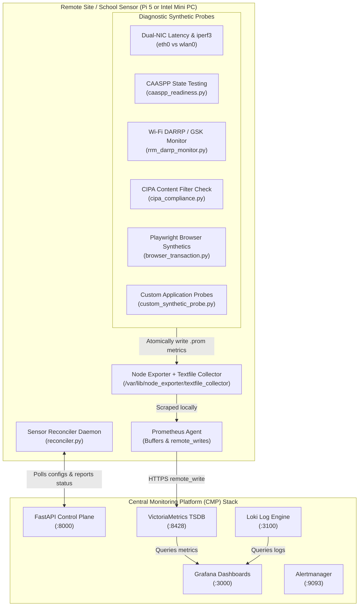

# Open Network Experience (ONE) Getting Started Guide

Welcome to the **Open Network Experience (ONE)** platform! This comprehensive guide walks you through standing up the Central Monitoring Platform (CMP) server stack in Docker, deploying physical edge sensors, using the pre-built Grafana NOC dashboards, and building custom synthetic tests for your local applications.

---

## Table of Contents
1. [Architecture Overview](#architecture-overview)
2. [Part 1: Standing Up the Server Stack (Docker Compose)](#part-1-standing-up-the-server-stack)
3. [Part 2: Deploying Physical & Virtual Sensors](#part-2-deploying-physical--virtual-sensors)
4. [Part 3: Exploring the Pre-Built Grafana Dashboards](#part-3-exploring-the-pre-built-grafana-dashboards)
5. [Part 4: Building Custom Synthetic Application Tests](#part-4-building-custom-synthetic-application-tests)
6. [Part 5: Troubleshooting & Operational FAQ](#part-5-troubleshooting--operational-faq)

---

## Architecture Overview



---

## Part 1: Standing Up the Server Stack

### 1. Prerequisites
* A Linux server or Cloud VM (Ubuntu 22.04 / 24.04 LTS or Debian 12 recommended).
* Minimum **2 CPU Cores**, **4 GB RAM**, and **20 GB Disk**.
* **Docker Engine** (v24+) and **Docker Compose** installed.

### 2. Clone and Launch
```bash
# 1. Clone the repository
git clone https://github.com/leifdavisson/Open_Network_Experience.git
cd Open_Network_Experience/server/deploy

# 2. Build and start all 5 containers in detached mode
docker compose up --build -d
```

### 3. Verify Container Status
Run `docker compose ps` to verify all services are running:
```bash
NAME                        IMAGE                            STATUS
cmp-server                  open-ux/cmp-server:latest        Up (healthy)
victoriametrics             victoriametrics/victoria-metrics Up
grafana                     grafana/grafana:latest           Up
loki                        grafana/loki:latest              Up
alertmanager                prom/alertmanager:latest         Up
```

### 4. Access the Web Portals
* **Grafana Dashboards**: `http://<your-server-ip>:3000` (User: `admin` / Password: `admin`)
* **Interactive API Documentation (Swagger)**: `http://<your-server-ip>:8000/docs`
* **VictoriaMetrics TSDB API**: `http://<your-server-ip>:8428`

---

## Part 2: Deploying Physical & Virtual Sensors

### 1. Hardware Requirements
* **Recommended Platforms**: Raspberry Pi 5 (8GB) or Intel N100 / N300 Mini-PC.
* **Network Interfaces**:
  * **Wired NIC (`eth0`)**: Connects to the local switch / wall jack (serves as the scientific control baseline).
  * **Wireless NIC (`wlan0`)**: Wi-Fi 6 / 6E / 7 radio connecting to school/enterprise SSIDs.

### 2. Run the Sensor Bootstrap Installer
On the edge sensor machine (running Debian or Ubuntu):
```bash
# Clone the repository onto the sensor
git clone https://github.com/leifdavisson/Open_Network_Experience.git
cd Open_Network_Experience/sensor

# Run the automated installer with root privileges
sudo ./install.sh
```

### 3. Configure the Sensor Reconciler
Edit `/etc/sensor/reconciler.json`:
```bash
sudo nano /etc/sensor/reconciler.json
```
```json
{
    "cmp_url": "http://<YOUR_CMP_SERVER_IP>:8000/api/v1",
    "sensor_id": "auto",
    "api_key": "",
    "check_interval_seconds": 60,
    "wifi_interface": "wlan0",
    "wifi_config_path": "/etc/wpa_supplicant/wpa_supplicant.conf"
}
```
> [!NOTE]
> Leave `api_key: ""` empty. The sensor will automatically enter the **Trust-On-First-Use (TOFU)** pending approval queue.

### 4. Start the Service
```bash
sudo systemctl start sensor-reconciler
sudo systemctl enable sensor-reconciler
```

### 5. Approve the Sensor on the CMP Control Plane
From your admin terminal or Swagger UI:

```bash
# 1. View pending sensors (admin key required)
curl -H "X-API-Key: admin-noc-key-change-me" http://<YOUR_CMP_SERVER_IP>:8000/api/v1/sensors

# 2. Approve the sensor (generates and provisions its unique cryptographic key)
curl -X POST \
  -H "X-API-Key: admin-noc-key-change-me" \
  http://<YOUR_CMP_SERVER_IP>:8000/api/v1/sensors/<sensor_uuid>/approve
```

The sensor will automatically download its unique API key on its next 60-second check-in and begin sending telemetry!

---

## Part 3: Exploring the Pre-Built Grafana Dashboards

When you open Grafana at `http://<your-server-ip>:3000`, three production-grade dashboards are automatically provisioned:

### 1. Master NOC Dashboard (`OpenUX NOC & Diagnostic Dashboard`)
* **Level 1 — Site NOC Overview**: CIPA content filter compliance table and WAN connectivity indicator.
* **Level 2 — Diagnostic Path Latency**: End-to-end hop-by-hop latency breakdowns.
* **Level 3 — Sensor Host Health**: Sensor CPU, memory, and Playwright execution event logs.
* **Level 4 — Dual-NIC & Bandwidth Diagnostics**: Side-by-side Wired (`eth0`) vs. Wireless (`wlan0`) latency comparison and scheduled `iperf3` throughput metrics.
* **Level 5 — CAASPP & ELPAC State Testing Readiness**: Live health table of California Assessment testing services and SSL inspection bypass validation.
* **Level 6 — Wi-Fi RRM & DARRP Spectrum Health**: AP channel dwelling timeline, flapping alerts (>3 switches/hour), and co-channel neighbor collision counts.

### 2. CAASPP State Testing Readiness Dashboard (`openux-caaspp`)
* Dedicated for school testing seasons.
* Highlights **Cambium Student Testing Interface**, **TIDE**, **ETS TOMS**, and **Smarter Balanced SSO**.
* Displays immediate red warnings if a firewall MITM certificate is detected.

### 3. Wi-Fi RF, DARRP & Spectrum Health Dashboard (`openux-wifi-rf`)
* Dedicated for Wi-Fi and RF engineers.
* Charts RSSI signal strength, Signal-to-Noise Ratio (SNR), and 802.11 Association, WPA/EAP Authentication, and DHCP lease duration metrics.

---

## Part 4: Building Custom Synthetic Application Tests

OpenUX makes it simple to test any internal application (e.g. Canvas LMS, PowerSchool SIS, Print Servers, SIP Gateways) using the **Prometheus Textfile Collector pattern**.

### 1. Use the Provided Probe Template
A complete starter template is located in [`sensor/examples/custom_synthetic_probe.py`](file:///data/Open_Network_Experience/sensor/examples/custom_synthetic_probe.py):

```python
#!/usr/bin/env python3
import time, urllib.request, os

TARGET_URL = "https://canvas.district.edu/login"
OUTPUT_FILE = "/var/lib/node_exporter/textfile_collector/custom_canvas.prom"

def test_canvas():
    start = time.time()
    try:
        req = urllib.request.Request(TARGET_URL, headers={"User-Agent": "OpenUX-Probe/1.0"})
        with urllib.request.urlopen(req, timeout=5) as response:
            latency = time.time() - start
            status = 1 if response.status == 200 else 0
    except Exception:
        status, latency = 0, time.time() - start

    # Atomically write metrics
    prom_data = f"""# HELP custom_canvas_status LMS health status (1=OK, 0=Fail)
# TYPE custom_canvas_status gauge
custom_canvas_status {status}
# HELP custom_canvas_latency_seconds Response time in seconds
# TYPE custom_canvas_latency_seconds gauge
custom_canvas_latency_seconds {latency:.4f}
"""
    tmp = OUTPUT_FILE + ".tmp"
    with open(tmp, "w") as f:
        f.write(prom_data)
    os.replace(tmp, OUTPUT_FILE)

if __name__ == "__main__":
    test_canvas()
```

### 2. Schedule Your Custom Probe
Add a cron job on the sensor to execute your custom test every 2 minutes:
```bash
sudo crontab -e
```
```text
*/2 * * * * /usr/bin/python3 /usr/local/bin/custom_canvas.py > /dev/null 2>&1
```

### 3. Graph It in Grafana
In your Grafana dashboard, simply add a panel with the PromQL query:
```promql
custom_canvas_latency_seconds{instance=~"$sensor"} * 1000
```
Node Exporter and VictoriaMetrics will automatically ingest your custom metrics!

---

## Part 5: Troubleshooting & Operational FAQ

### Q1: How do I check sensor logs in real time?
```bash
sudo journalctl -u sensor-reconciler -f
```

### Q2: Why is the sensor showing "Pending Approval"?
Brand new sensors must be approved by an administrator before they can check in. Run:
```bash
curl -X POST -H "X-API-Key: admin-noc-key-change-me" http://<CMP_IP>:8000/api/v1/sensors/<sensor-id>/approve
```

### Q3: How do I run a manual test on the sensor immediately?
```bash
# Test CAASPP state testing endpoints & SSL bypass
python3 /usr/local/bin/caaspp_readiness.py

# Test Wi-Fi DARRP / GSK channel switches and RF health
python3 /usr/local/bin/rrm_darrp_monitor.py

# Test CIPA content filtering compliance
python3 /usr/local/bin/cipa_compliance.py

# Run a 100 Mbps rate-limited bandwidth test
python3 /usr/local/bin/iperf3_runner.py --server speedtest.district.org --bandwidth-cap 100
```

### Q4: How do I change the administrative API key?
In `server/main.py`, update `ADMIN_API_KEY` (or pass it via an environment variable) and restart the `cmp-server` container:
```bash
cd server/deploy && docker compose restart cmp-server
```
