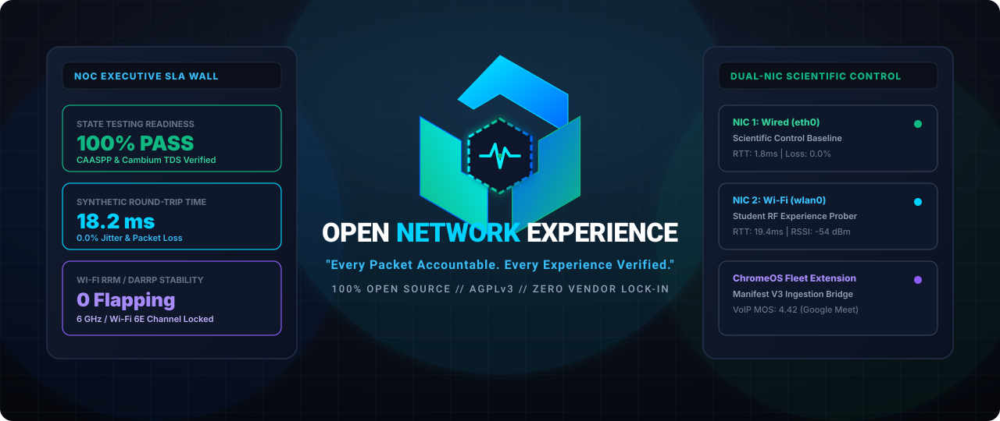
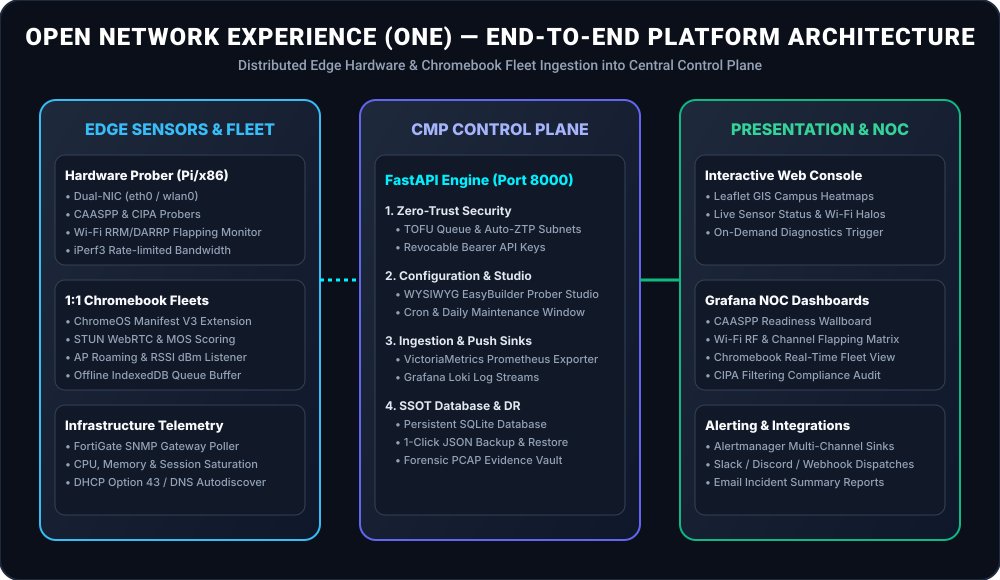
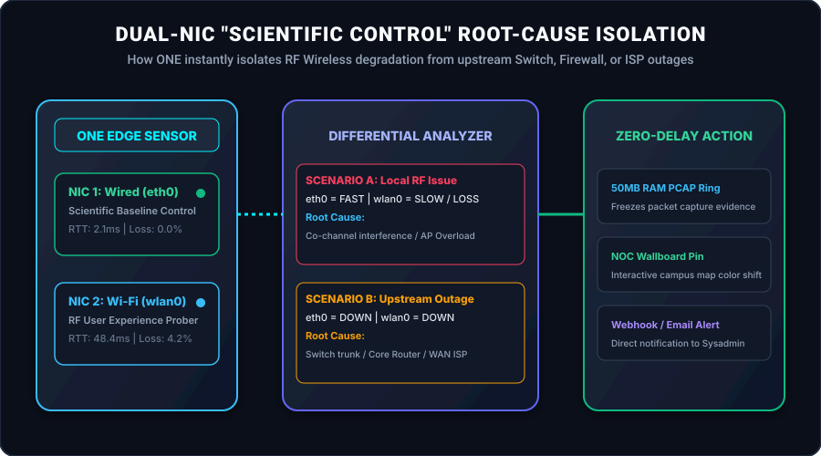

<div align="center">


# Open Network Experience (ONE)

**"Every Packet Accountable. Every Experience Verified."**

<p align="center">
  <a href="LICENSE"></a>
  <a href="https://github.com/leifdavisson/Open_Network_Experience/actions/workflows/ci.yml"></a>
  <a href="https://github.com/leifdavisson/Open_Network_Experience/actions/workflows/security.yml"></a>
  
  
</p>

<p align="center">
  
</p>

</div>

**Open Network Experience (ONE)** is a 24/7 digital assistant and synthetic network assurance platform for schools, enterprise campuses, and public networks. Think of it as a virtual student and teacher sitting in classrooms, lecture halls, libraries, and offices around the clock—constantly testing the Wi-Fi RF health, state testing portals, and school internet to ensure everything works smoothly *before* the morning bell rings.

Instead of waiting for a classroom of students to get disconnected during state testing or finding out a video lesson is buffering during second period, Open Network Experience continuously tests the network from the user's point of view. It alerts school technology teams to Wi-Fi dead spots, AP channel flapping, slow learning portals, or content filter issues instantly so problems can be solved before they disrupt teaching and learning.

---

## 📑 Table of Contents

- [1. Overview & Brand Vision](#open-network-experience-one)
- [2. Prerequisites & Learning Curve](#2-prerequisites--learning-curve)
  - [Who Is This Platform Built For?](#who-is-this-platform-built-for)
  - [Helpful Foundational Knowledge](#what-basic-knowledge-is-helpful-before-rolling-this-out)
- [3. Directory Structure](#3-directory-structure)
- [4. Getting Started](#4-getting-started)
  - [4.1 Launch the CMP Server Telemetry Stack](#1-launch-the-cmp-server-telemetry-stack-cloud--datacenter)
  - [4.2 Set Up a New Edge Hardware Sensor](#2-set-up-a-new-edge-sensor)
  - [4.3 Deploy the Chromebook Fleet Sensor](#3-deploy-the-chromebook-fleet-sensor)
- [5. Platform Architecture & Key Features](#5-platform-architecture--key-features)
  - [5.1 Core Management Platform (CMP) & Control Plane](#51-core-management-platform-cmp--control-plane)
  - [5.2 Edge Sensor Fleet (Linux Hardware - Raspberry Pi & x86)](#52-edge-sensor-fleet-linux-hardware)
  - [5.3 Chromebook Sensor Fleet (ChromeOS Extension & Kiosk)](#53-chromebook-sensor-fleet-chromeos)
- [6. Brand, Marketing & Whitepaper Collateral](#6-brand-marketing--whitepaper-collateral)
- [7. Running Diagnostics Manually](#7-running-diagnostics-manually)
- [8. Development & Test Execution](#8-development--test-execution)
- [9. License & Disclaimers](#9-license--disclaimers)

---

## 2. Prerequisites & Learning Curve

### Who Is This Platform Built For?
Open Network Experience (ONE) is designed for **K-12 Technology Directors, Network Administrators, Systems Engineers, and Field Technicians**.

### What Basic Knowledge Is Helpful Before Rolling This Out?
You don't need a high-level engineering certification (like a CCIE or CWNE) to deploy and operate ONE, but having familiarity with the following core concepts will give you the best experience:

1. **Basic Linux Command Line**:
   * Navigating folders and managing files (`cd`, `ls`, `mkdir`, `cp`).
   * Executing administrative commands with `sudo`.
   * Editing simple configuration files using a terminal editor (like `nano` or `vim`).
   * Checking system logs and service health (`journalctl -u <service> -f`, `systemctl status`).
2. **Fundamental Networking Concepts**:
   * Understanding IP addresses, Subnet Masks, Default Gateways, and DNS resolvers.
   * How clients obtain dynamic IP addresses via **DHCP**.
   * The difference between **Wired (Ethernet)** and **Wireless (Wi-Fi 2.4/5/6 GHz)** network segments.
   * Connecting devices to school Wi-Fi networks (WPA2/WPA3 Pre-Shared Keys or 802.1X enterprise logins).
3. **Basic Docker Container Concepts**:
   * Understanding that server applications run in lightweight background containers (`docker compose up -d`, `docker ps`).

---

> [!TIP]
> ### 💡 A Great Way to Learn Linux and Network Engineering!
> If you are a junior IT technician, school help desk specialist, or student intern looking to sharpen your Linux, Docker, and enterprise network troubleshooting skills, **Open Network Experience is a fantastic, hands-on learning project!**
>
> The platform automates the complex scripting and provides clean visual web dashboards, allowing you to learn by exploring real-world network metrics and telemetry.

---

## 3. Directory Structure

* **[`/sensor`](file:///data/Open_Network_Experience/sensor)** (`file:///data/Open_Network_Experience/sensor`): Codebase and configurations running on edge sensor hardware.
  * `install.sh`: Hardware compliance checker (4-core, 8GB RAM, 32GB disk) and system bootstrap script.
  * `reconciler/reconciler.py`: Edge state pull agent, container orchestrator, and test schedule runner.
  * `caaspp_readiness.py`: State testing network readiness and SSL inspection bypass validator.
  * `rrm_darrp_monitor.py`: FortiGate DARRP / GSK dynamic channel shift and RF flapping monitor.
  * `iperf3_runner.py`: Rate-limited scheduled and on-demand bandwidth/jitter tester.
  * `cipa_compliance.py`: CIPA web filtering compliance check.
  * `wifi_dhcp_exporter.py`: Passive journald log parsing for L2/L3 handshake speed.
  * `browser_transaction.py`: Playwright web transaction and blocked asset tracking.
* **[`/chromebook-sensor`](file:///data/Open_Network_Experience/chromebook-sensor)** (`file:///data/Open_Network_Experience/chromebook-sensor`): Manifest V3 extension and kiosk prober for ChromeOS fleets.
  * `manifest.json` & `schema.json`: ChromeOS enterprise managed extension config.
  * `src/background/device_telemetry.js`: Dynamic enterprise serial, asset tag, CPU, memory, battery vitals.
  * `src/background/network_private.js`: ChromeOS Wi-Fi BSSID, RSSI dBm, frequency band, channel, and roaming listener.
  * `src/offscreen/webrtc_prober.js`: UDP STUN latency, jitter, packet loss, and ITU-T G.107 E-model VoIP MOS rating engine.
  * `src/probes/http_synthetic.js`: Resource Timing API synthetic app probers (CAASPP, LMS, Clever, Lightspeed).
  * `src/db/indexed_db.js`: Offline IndexedDB FIFO telemetry buffer with automatic reconnection replay.
* **[`/server`](file:///data/Open_Network_Experience/server)** (`file:///data/Open_Network_Experience/server`): Backend FastAPI Control Plane and telemetry deployment configuration.
  * `main.py`: FastAPI endpoints for edge registration, reconcile check-in, test scheduling, on-demand triggers, and Chromebook ingestion.
  * `schemas.py`: Pydantic validation schemas, credential redaction models (`SensorStatusResponseSafe`), and test specifications.
  * `test_integration.py`: End-to-end integration test suite validating registration, approval, test schedules, and telemetry ingestion.
  * `deploy/`: Docker Compose deployment stack ([VictoriaMetrics](https://victoriametrics.com/), [Grafana](https://grafana.com/), [Grafana Loki](https://grafana.com/oss/loki/), Alertmanager, dashboards).
* **[`/assets`](file:///data/Open_Network_Experience/assets)** (`file:///data/Open_Network_Experience/assets`): Brand logos, vector marks, social cards, and architectural diagrams.
* **[`/docs`](file:///data/Open_Network_Experience/docs)** (`file:///data/Open_Network_Experience/docs`): Brand guide, Aruba UXI TCO comparison, District IT 1-pager, and launch playbook.

---

## 4. Getting Started

### 1. Launch the CMP Server Telemetry Stack (Cloud / Datacenter)
To spin up the control plane and Grafana visualizations:
```bash
cd server/deploy
docker compose up --build -d
```
* **Interactive CMP Web Dashboard**: `http://<server-ip>:8000`
* **Interactive API Documentation (Swagger)**: `http://<server-ip>:8000/docs`
* **Grafana NOC Dashboard**: `http://<server-ip>:3000` (User: `admin` / Password: `admin`)
* **VictoriaMetrics TSDB**: `http://<server-ip>:8428`

### 2. Set Up a New Edge Sensor
On your single-board computer ([Raspberry Pi](https://www.raspberrypi.com/) 4/5 or Intel N100) running Debian 12 or Ubuntu 22.04 LTS:
1. Copy the `sensor/` directory onto the device.
2. Run the automated installer:
   ```bash
   sudo ./install.sh
   ```
3. Edit `/etc/sensor/reconciler.json`. Point `cmp_url` to your server's IP/domain and leave `api_key` empty (`""`) to initiate registration:
   ```json
   {
       "cmp_url": "http://<your-server-ip>:8000/api/v1",
       "sensor_id": "auto",
       "api_key": "",
       "check_interval_seconds": 60,
       "wifi_interface": "wlan0",
       "wifi_config_path": "/etc/wpa_supplicant/wpa_supplicant.conf"
   }
   ```
4. Start the reconciler daemon:
   ```bash
   sudo systemctl start sensor-reconciler
   sudo systemctl enable sensor-reconciler
   ```

### 3. Deploy the Chromebook Fleet Sensor
1. Load [`chromebook-sensor/`](file:///data/Open_Network_Experience/chromebook-sensor) in Developer Mode (`chrome://extensions`) or deploy fleet-wide via Google Workspace Admin Console.
2. Upload [`chromebook-sensor/schema.json`](file:///data/Open_Network_Experience/chromebook-sensor/schema.json) to configure CMP server URL and campus tags.
3. Telemetry and Wi-Fi experience metrics will stream automatically to the CMP NOC Wallboard and Grafana dashboards.

> 📖 **Step-by-Step Deployment Guide**: Check out [**`GETTING_STARTED.md`**](file:///data/Open_Network_Experience/GETTING_STARTED.md) (`file:///data/Open_Network_Experience/GETTING_STARTED.md`) for full deployment instructions, dashboard walkthroughs, and custom probe templates!

---

## 5. Platform Architecture & Key Features

<p align="center">
  
</p>

### 5.1 Core Management Platform (CMP) & Control Plane
- **[FastAPI](https://fastapi.tiangolo.com/) Control Plane**: High-performance REST API with persistent SQLite storage and zero-touch subnet auto-enrollment (ZTP).
- **Interactive GIS Campus Map**: [Leaflet.js](https://leafletjs.com/) dark-theme campus map rendering real-time glowing sensor status pins with Wi-Fi signal halos.
- **Visual Scheduling Engine**: Configures daily runs, maintenance window repetitions, continuous intervals, and raw cron schedules with built-in safety guardrails.
- **WYSIWYG EasyBuilder Custom Probe Studio**: Create custom HTTP/HTTPS/DNS synthetic probes via web UI with automatic fleet distribution.
- **SNMP FortiGate Telemetry Collector**: Gathers gateway CPU, memory, and active session metrics to detect campus WAN saturation.
- **1-Click Disaster Recovery**: Full JSON export and restore for all sensors, probes, campuses, schedules, and evidence bundles.
- **VictoriaMetrics & Grafana Provisioning**: Automated TSDB and dashboard provisioning with Alertmanager integration.

### 5.2 Edge Sensor Fleet (Linux Hardware)

<p align="center">
  
</p>

1. **Dual-NIC Split-Brain Diagnostics**: Leverages both Wired (`eth0`) and Wireless (`wlan0`) NICs. The wired connection acts as a **scientific control group** — instantly isolating whether degradation is caused by local RF/AP interference vs. upstream switch, firewall, or ISP failures.
2. **CAASPP & ELPAC State Testing Readiness**: Validates network reachability and latency against official California Assessment endpoints (Cambium TDS/TIDE, ETS TOMS, Smarter Balanced SSO) and verifies **SSL Inspection Bypass** (certificate pinning integrity) so secure testing browsers do not crash.
3. **Wi-Fi RRM, DARRP & GSK Optimization Monitor**: Observes dynamic Radio Resource Management (RRM) events from Fortinet FortiAPs (DARRP / Global Spectrum Knowledge) and enterprise controllers. Tracks channel dwell stability, counts Co-Channel Interference (CCI) collisions, and alerts on aggressive **channel flapping** (>3 switches/hour).
4. **Scheduled & Rate-Limited Bandwidth Testing (`iperf3`)**: Supports automated throughput and jitter testing with time-window restrictions (e.g., off-peak 20:00–06:00 only), bandwidth throttling caps, and on-demand NOC test triggers.
5. **Synthetic Browser Transactions ([Playwright](https://playwright.dev/))**: Runs headless Chromium browser workflows on a loop, reporting full render timings, DOMContentLoaded events, and tracking exactly which blocked third-party domains cause page slowness.
6. **L2/L3 Onboarding Exporter**: Dynamically parses system event logs to measure Access Point association speed, WPA/EAP authentication handshakes, and DHCP lease acquisition timings in seconds.
7. **CIPA Compliance Checker**: Conducts pre-flight internet connectivity checks, then tests connection categories (CSAM, Terrorist content, Pornography, SSL Decryption, swearing) using `testfiltering.com` tokens. Reports filter failure alerts immediately.
8. **Trust-On-First-Use (TOFU) Registration Queue**: Brand new edge sensors register in a `pending` state. Administrators approve devices via the administrative console, generating unique, revoked-at-will API keys for telemetry write authorizations.
9. **Three-Way Cloud Discovery**: Sensors automatically locate the CMP Cloud server via local configuration, DHCP search domain DNS (`openux-cmp.<domain>`), or global fallback portal.
10. **Pre-built 6-Tier NOC Dashboards**: Automatically provisions VictoriaMetrics, Loki logs, and Alertmanager inside Grafana, pre-loading an end-to-end NOC dashboard.

### 5.3 Chromebook Sensor Fleet (ChromeOS)
1. **Manifest V3 Extension & Kiosk Packaging**: Deployable fleet-wide via Google Workspace Admin Console with managed JSON policy schema (`schema.json`).
2. **Dynamic Enterprise Device Identity**: Queries `chrome.enterprise.deviceAttributes` for Serial Number, Asset ID tag, Room location, User email, and Hostname.
3. **Dynamic Hardware Resources**: Live CPU utilization percentage, memory usage, storage capacity, display resolution, and battery charging health.
4. **Active Wi-Fi RF & AP Roaming Telemetry**: Queries `chrome.networkingPrivate` for SSID, AP BSSID (MAC), RSSI dBm, 2.4/5/6 GHz frequency bands, and channel. Detects AP roaming handoffs and triggers instant diagnostic sweeps.
5. **Offscreen WebRTC STUN Latency & MOS Scoring**: Isolated offscreen document measures UDP STUN RTT, jitter, and packet loss, calculating ITU-T G.107 E-model MOS ratings (1.0–4.5) for Google Meet and Zoom.
6. **Synthetic App Performance Prober**: Captures millisecond-accurate DNS, TCP, TLS, and TTFB timings against CAASPP, Google Classroom, Clever SSO, and Lightspeed Filter.
7. **Offline IndexedDB Queue with Replay**: Buffers telemetry during Wi-Fi roaming disconnects and syncs batched events back to CMP upon reconnection.
8. **Pop-up Diagnostic HUD**: On-demand self-service network health widget for field techs and teachers.

> 📖 **Full Chromebook Sensor Guide**: See [**`chromebook-sensor/README.md`**](file:///data/Open_Network_Experience/chromebook-sensor/README.md) (`file:///data/Open_Network_Experience/chromebook-sensor/README.md`) for setup, admin console policies, and architecture.

---

## 6. Brand, Marketing & Whitepaper Collateral

The project includes complete branding guidelines, competitive analyses, executive briefs, and community launch assets:

* [Open `BRAND_GUIDE.md`](file:///data/Open_Network_Experience/docs/BRAND_GUIDE.md) (`file:///data/Open_Network_Experience/docs/BRAND_GUIDE.md`) — Official design system, NOC dark color palette, vector assets, and typography rules.
* [Open `COMPARISON_ARUBA_UXI_7SIGNAL.md`](file:///data/Open_Network_Experience/docs/COMPARISON_ARUBA_UXI_7SIGNAL.md) (`file:///data/Open_Network_Experience/docs/COMPARISON_ARUBA_UXI_7SIGNAL.md`) — Detailed architectural comparison and 5-year K-12 Total Cost of Ownership (TCO) breakdown ($205k+ savings).
* [Open `DISTRICT_IT_DIRECTOR_ONE_PAGER.md`](file:///data/Open_Network_Experience/docs/DISTRICT_IT_DIRECTOR_ONE_PAGER.md) (`file:///data/Open_Network_Experience/docs/DISTRICT_IT_DIRECTOR_ONE_PAGER.md`) — Executive 1-pager tailored for School Boards, Superintendents, and Technology Directors.
* [Open `COMMUNITY_LAUNCH_PLAYBOOK.md`](file:///data/Open_Network_Experience/docs/COMMUNITY_LAUNCH_PLAYBOOK.md) (`file:///data/Open_Network_Experience/docs/COMMUNITY_LAUNCH_PLAYBOOK.md`) — Pre-written announcement posts and templates for Hacker News (*Show HN*), Reddit (`r/networking`, `r/k12sysadmin`, `r/homelab`), and Product Hunt.

---

## 7. Running Diagnostics Manually

You can test individual diagnostic modules on the sensor directly:

```bash
# CAASPP / ELPAC State Testing Readiness & SSL Bypass Check
python3 /data/Open_Network_Experience/sensor/caaspp_readiness.py

# Wi-Fi RRM / DARRP / GSK Radio Optimization & Flapping Check
python3 /data/Open_Network_Experience/sensor/rrm_darrp_monitor.py

# Scheduled Bandwidth Test (Rate-limited to 100M)
python3 /data/Open_Network_Experience/sensor/iperf3_runner.py --server iperf3.example.com --bandwidth-cap 100

# CIPA Content Filter Compliance
python3 /data/Open_Network_Experience/sensor/cipa_compliance.py

# Wi-Fi & DHCP Onboarding Timings
python3 /data/Open_Network_Experience/sensor/wifi_dhcp_exporter.py
```

---

## 8. Development & Test Execution

Run the integration test suite against the live Docker stack:
```bash
# Run ChromeOS extension unit tests
npm test --prefix chromebook-sensor

# Run Python CMP & edge sensor test suite
pytest
```

---

## 9. License & Disclaimers

### License
This project is licensed under the **[GNU Affero General Public License v3.0 (AGPL-3.0)](file:///data/Open_Network_Experience/LICENSE)** (`file:///data/Open_Network_Experience/LICENSE`). See the [LICENSE](LICENSE) file for the full license text.

### Disclaimers & Trademarks
* **Trademarks**: All product names, logos, brands, trademarks, and registered trademarks mentioned within this project or documentation (including Aruba UXI, 7SIGNAL, Cisco ThousandEyes, Fortinet, Google ChromeOS, Cambium, ETS) are property of their respective owners. Their use does not imply any affiliation with, endorsement by, or sponsorship by those owners.
* **Privacy & Compliance**: ONE is a synthetic network telemetry platform. It generates synthetic test traffic to measure infrastructure performance and does not collect, inspect, or log human student, staff, or user payload data. Packet capture modules enforce automatic header slicing (`-s 128`) to discard application payloads.
* **Warranty**: As provided under the AGPL-3.0 license, this software is provided "AS IS", without warranty of any kind, express or implied.
