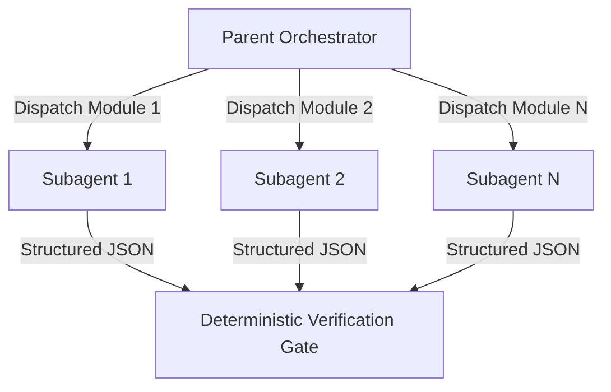
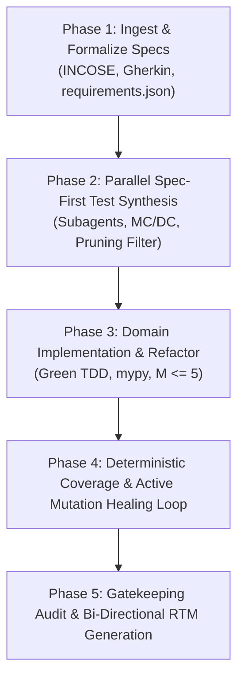

# Automated V&V Architect

## Summary

Executes an automated, high-assurance software engineering lifecycle. Formalizes natural-language requirements into executable Gherkin specifications, orchestrates parallel subagents to generate property-based and MC/DC test suites before code implementation, enforces strict deterministic coverage and active mutation testing healing loops, and maintains AST-verified bi-directional Requirements Traceability Matrices (RTM).

## When to Use

- Formalizing ambiguous user requirements into verifiable BDD specifications.
- Implementing mission-critical software using strict TDD/BDD micro-cycles.
- Eliminating coverage gaps using Modified Condition/Decision Coverage (MC/DC).
- Validating assertion quality using active mutation score healing ([mutmut](https://mutmut.readthedocs.io/)).
- Orchestrating parallel subagents across multiple decoupled modules or test suites.
- Generating formal audit reports and RTM compliance artifacts (ISO 26262, DO-178C, IEC 62304).

## Subagent Orchestration Protocol

The parent agent coordinates the lifecycle, manages state, and enforces quality gates. Parallel subagents handle module-specific synthesis to prevent context exhaustion.

```text
                       [ Parent Orchestrator ]
                           /        |        \
         Dispatch Module 1/  Module 2|         \Module N
                         v          v          v
                    [Subagent]  [Subagent]  [Subagent]
                         \          |          /
         Structured JSON  \         |         / Structured JSON
                           v        v        v
                       [ Deterministic Verification Gate ]
```



### Delegation Rules:
- **Phase 2 (Spec-First Tests):** Spawn parallel subagents for each decoupled module defined in `requirements.json`.
- **Phase 4 (Mutation Healing):** Spawn independent subagents per surviving mutant cluster to generate targeted boundary tests in parallel.
- **Task Packaging:** Every subagent invocation must be self-contained and specify input file paths, interface protocols, requirement IDs, and a required JSON schema for output.
- **Single-Level Hierarchy:** Subagents execute worker tasks and return results; they never spawn further nested subagents.

## Operational Lifecycle Protocol

Execute the following 5 phases in strict sequential order. Do not skip phases or bypass deterministic verification gates.



### Phase 1: Requirements Ingestion, Formalization, and Ambiguity Detection

1. Parse stakeholder requirements and evaluate against INCOSE and IEEE 830 rules:
   - Flag and resolve passive voice, unquantified adjectives (e.g., "fast", "scalable"), and missing numerical tolerances.
2. Initialize `requirements.json` with unique IDs (`REQ-XXX`), hazard levels, and acceptance criteria.
3. Formalize business behavior into executable [Gherkin](https://cucumber.io/docs/gherkin/) feature files under `features/<module>.feature`.
4. Ensure Oracle Independence: Every `Then` step must define an independent mathematical relation or state expectation.

### Phase 2: Distributed Spec-First Test Synthesis & Candidate Pruning

1. Identify decoupled domain modules from `requirements.json`.
2. For each module, spawn an independent subagent via `default_api:invoke_subagent`:
   - **Input:** `features/<module>.feature` and relevant schemas from `requirements.json`.
   - **Action:** Synthesize unit tests, property-based invariant tests ([Hypothesis](https://hypothesis.readthedocs.io/)), and MC/DC truth-table vectors.
   - **Annotation:** Decorate each test with `@verifies("REQ-XXX")`.
   - **Candidate Pruning Filter:** Discard tests with zero assertions or tautological logic. Verify all tests fail cleanly against missing code (RED phase).
3. Collect subagent summaries and verify that all test harnesses are primed.

### Phase 3: Minimal Domain Implementation & Refactoring

1. Implement minimal domain logic under `src/<module>.py` to satisfy failing tests (GREEN phase).
2. Enforce strict static typing:
   ```bash
   mypy --strict src/
   ```
   *(Reference: [mypy documentation](https://mypy.readthedocs.io/))*
3. Enforce structural decoupling:
   - Apply Dependency Inversion (IoC) with abstract protocols/interfaces.
   - Maintain McCabe Cyclomatic Complexity $M \le 5$ per routine.

### Phase 4: Deterministic Coverage & Active Mutation Healing Loop

1. Run deterministic statement and branch coverage:
   ```bash
   pytest --cov=src --cov-branch --cov-report=json tests/
   ```
   *(References: [pytest](https://docs.pytest.org/), [pytest-cov](https://pytest-cov.readthedocs.io/))*
   - Enforce 100% statement and branch coverage.
2. Execute MC/DC truth-table verification across compound predicates:
   ```bash
   python scripts/verify_mcdc.py
   ```
3. Execute mutation analysis to evaluate test assertion quality:
   ```bash
   mutmut run
   ```
   *(Reference: [mutmut documentation](https://mutmut.readthedocs.io/))*
4. **Active Mutation Healing Loop:**
   - If mutation score $MS < 90\%$, extract surviving mutant AST diffs.
   - Delegate surviving mutants to parallel subagents with targeted prompts containing the exact mutated line and operator change (e.g., `AOR: + replaced by -`, `ROR: <= replaced by <`).
   - Append synthesized boundary tests and re-run `mutmut` until $MS \ge 90\%$.

### Phase 5: Automated Verification Gatekeeping & Traceability Audit

1. Execute the AST traceability parser:
   ```bash
   python scripts/generate_rtm.py
   ```
2. Verify zero unmapped requirements, zero orphaned tests, and zero unverified safety tags.
3. Run change impact analysis: If requirements changed, confirm all affected tests were re-executed.
4. Output final audit artifacts: `RTM_MATRIX.json` and `VERIFICATION_REPORT.md`.

## Deterministic Automation Tooling

### 1. AST Requirements Traceability Generator (`scripts/generate_rtm.py`)

```python
#!/usr/bin/env python3
# License: GNU AGPLv3 (GNU Affero General Public License v3.0)
import ast
import json
import sys
from pathlib import Path
from typing import Dict, List

class RTMParser(ast.NodeVisitor):
    def __init__(self) -> None:
        self.mappings: Dict[str, List[str]] = {}

    def visit_FunctionDef(self, node: ast.FunctionDef) -> None:
        for decorator in node.decorator_list:
            if isinstance(decorator, ast.Call):
                func = decorator.func
                if (isinstance(func, ast.Name) and func.id == "verifies") or \
                   (isinstance(func, ast.Attribute) and func.attr == "verifies"):
                    for arg in decorator.args:
                        if isinstance(arg, ast.Constant) and isinstance(arg.value, str):
                            self.mappings.setdefault(arg.value, []).append(node.name)
        self.generic_visit(node)

def run_audit(req_file: str, test_dir: str, output_file: str) -> bool:
    with open(req_file, "r", encoding="utf-8") as f:
        reqs = json.load(f)

    parser = RTMParser()
    for py_file in Path(test_dir).rglob("test_*.py"):
        with open(py_file, "r", encoding="utf-8") as f:
            parser.visit(ast.parse(f.read(), filename=str(py_file)))

    rtm_data = []
    uncovered = []

    for req in reqs:
        req_id = req["id"]
        tests = parser.mappings.get(req_id, [])
        if not tests:
            uncovered.append(req_id)
        rtm_data.append({
            "requirement_id": req_id,
            "title": req.get("title", ""),
            "safety_level": req.get("safety_level", "STANDARD"),
            "verifying_tests": tests,
            "status": "VERIFIED" if tests else "UNCOVERED"
        })

    with open(output_file, "w", encoding="utf-8") as f:
        json.dump(rtm_data, f, indent=2)

    if uncovered:
        print(f"RTM AUDIT FAILED: Uncovered requirements: {uncovered}", file=sys.stderr)
        return False
    print("RTM AUDIT PASSED: 100% Requirements Traceability Verified.")
    return True

if __name__ == "__main__":
    success = run_audit("requirements.json", "tests", "RTM_MATRIX.json")
    sys.exit(0 if success else 1)
```

## Gotchas & Failure Modes

- **Oracle Problem & Tautological Assertions:** Never generate assertions by running the implementation under test. Assertions must be derived exclusively from Gherkin specifications or formal domain invariants.
- **Equivalent Mutants:** When a mutant survives because it is semantically identical (undecidable under Rice's Theorem), document the AST equivalence in `VERIFICATION_REPORT.md` rather than writing redundant tests.
- **Mock Fragility (London School):** Avoid mocking internal private methods. Restrict test doubles to architectural I/O boundaries and validate doubles using contract tests or static protocols.
- **Subagent Context Bleed:** Always provide complete, explicit file paths and schemas to subagents; never assume child agents share memory or conversational history.
