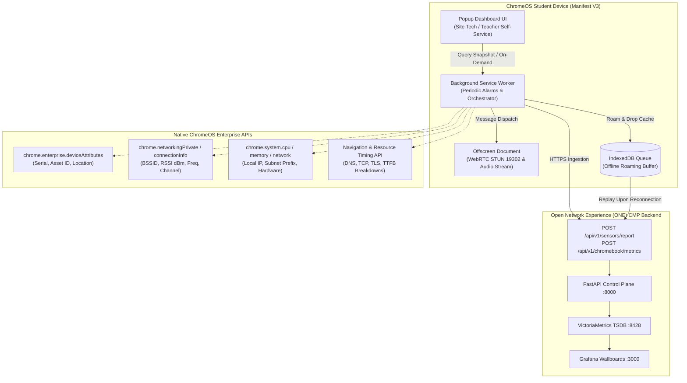

# Open Network Experience (ONE) — Chromebook Sensor

> **License**: [GNU Affero General Public License v3.0 (GNU AGPLv3)](https://www.gnu.org/licenses/agpl-3.0.html)
> **Platform**: ChromeOS / Google Chrome (Manifest V3 Extension & Kiosk Application)
> **Repository**: [Open Network Experience (ONE)](https://github.com/leifdavisson/Open_Network_Experience)
> **File Link**: [Open README.md](file:///data/Open_Network_Experience/chromebook-sensor/README.md) (`file:///data/Open_Network_Experience/chromebook-sensor/README.md`)

---

## 1. Overview & Architecture

The **ONE Chromebook Sensor** brings synthetic network diagnostics and real-time Wi-Fi experience monitoring directly to **ChromeOS student and 1:1 fleet devices**. While traditional edge sensors (such as Raspberry Pis or mini-PCs) measure network quality from static wall or ceiling locations, the Chromebook Sensor measures performance directly from the student's physical perspective as they roam between classrooms, libraries, and stadiums.



---

## 2. Key Components & Directory Structure

```text
chromebook-sensor/
├── manifest.json              # Chrome Manifest V3 descriptor with enterprise permissions
├── schema.json                # Managed Policy Schema for Google Workspace Admin Console
├── package.json               # Node.js test suite runner & metadata
├── README.md                  # Component architecture & deployment guide
├── icons/                     # Extension icons (16x16, 48x48, 128x128)
├── src/
│   ├── background/
│   │   ├── service_worker.js  # Alarm scheduler, prober lifecycle, roaming handler
│   │   ├── device_telemetry.js# chrome.enterprise.deviceAttributes & system hardware
│   │   ├── network_private.js # chrome.networkingPrivate Wi-Fi BSSID, RSSI, channel
│   │   ├── storage_sync.js    # IndexedDB replay & synchronization manager
│   │   └── config_manager.js  # Managed storage policy resolver
│   ├── offscreen/
│   │   ├── offscreen.html     # DOM host for WebRTC STUN measurements
│   │   ├── offscreen.js       # Background message dispatcher for offscreen context
│   │   └── webrtc_prober.js   # STUN RTT, jitter, and candidate pair analyzer
│   ├── probes/
│   │   ├── http_synthetic.js  # Synthetic DNS/TCP/TLS/TTFB resource timing prober
│   │   ├── dns_lookup.js      # DNS-over-HTTPS (DoH) resolution timing
│   │   └── mos_calculator.js  # ITU-T G.107 E-model VoIP Mean Opinion Score
│   ├── db/
│   │   └── indexed_db.js      # Persistent offline queue with FIFO backpressure
│   ├── popup/
│   │   ├── popup.html         # Real-time technician diagnostic popup
│   │   ├── popup.css          # Dark-mode styling matching CMP UI
│   │   └── popup.js           # UI state binding & on-demand trigger
│   └── utils/
│       ├── logger.js          # Structured prefix logging
│       └── reporter.js        # Standardized payload builder & HTTP client
└── test/
    ├── mocks/
    │   └── chrome_mock.js     # Enterprise ChromeOS & WebRTC API test mocks
    ├── test_device_telemetry.test.js
    ├── test_indexed_db.test.js
    ├── test_mos_calculator.test.js
    └── test_reporter.test.js
```

---

## 3. ChromeOS Enterprise & Web APIs Utilized

1. **Enterprise Identity**:
   - [`chrome.enterprise.deviceAttributes.getDeviceSerialNumber()`](https://developer.chrome.com/docs/extensions/reference/api/enterprise/deviceAttributes): Deterministically identifies the exact Chromebook serial number.
   - [`chrome.enterprise.deviceAttributes.getDeviceAssetId()`](https://developer.chrome.com/docs/extensions/reference/api/enterprise/deviceAttributes): Extracts district asset tag for inventory correlation.
   - [`chrome.enterprise.deviceAttributes.getDeviceAnnotatedLocation()`](https://developer.chrome.com/docs/extensions/reference/api/enterprise/deviceAttributes): Maps device to school room/building.
2. **Wi-Fi RF & Roaming**:
   - [`chrome.networkingPrivate`](https://developer.chrome.com/docs/extensions/reference/api/networkingPrivate): Active Wi-Fi SSID, AP BSSID (MAC address), RSSI dBm signal strength, and Frequency/Channel.
   - Handover detection triggers immediate fast-probe sweep when BSSID transitions.
3. **WebRTC STUN & VoIP MOS**:
   - [`chrome.offscreen`](https://developer.chrome.com/docs/extensions/reference/api/offscreen): Hosts WebRTC `RTCPeerConnection` in Manifest V3 without blocking the background worker.
   - [ITU-T G.107 E-model](https://www.itu.int/rec/T-REC-G.107): Computes real-time transmission rating factor ($R$) and Mean Opinion Score ($1.0 - 4.5$) for Google Meet and Zoom classroom streaming.
4. **Synthetic App Probing**:
   - [Resource Timing API](https://developer.mozilla.org/en-US/docs/Web/API/PerformanceResourceTiming): Millisecond-level breakdowns for DNS lookup, TCP connect, TLS handshake, and Time To First Byte (TTFB) against CAASPP, Google Classroom, Clever, and Lightspeed.
5. **Offline Buffering**:
   - [IndexedDB API](https://developer.mozilla.org/en-US/docs/Web/API/IndexedDB_API): Stores telemetry events during Wi-Fi roaming disconnects or WAN outages with automatic FIFO pruning and replay when network connectivity returns.

---

## 4. Google Workspace Admin Console Deployment Guide

To deploy the ONE Chromebook Sensor across your school district or enterprise fleet:

1. Log into the **[Google Workspace Admin Console](https://admin.google.com)**.
2. Navigate to **Devices > Chrome > Apps & extensions > Users & browsers** (or **Kiosks**).
3. Select your target Organizational Unit (OU) (e.g., `/High Schools/Students` or `/Chromebook Carts`).
4. Click **Add from Chrome Web Store** or **Add by Extension ID** (or upload unpacked zip for testing).
5. Set the installation policy to **Force install + pin to browser toolbar**.
6. Under **Policy for extensions**, upload or paste your JSON configuration matching [`schema.json`](file:///data/Open_Network_Experience/chromebook-sensor/schema.json):

```json
{
  "cmp_server_url": "https://cmp.example.edu:8000",
  "api_key": "YOUR_DISTRICT_SENSOR_KEY",
  "campus_id": "CAMPUS-WEST-HIGH",
  "probe_interval_seconds": 60,
  "enable_webrtc_probing": true,
  "enable_offline_buffer": true,
  "max_offline_records": 1000,
  "synthetic_http_targets": [
    {
      "name": "Google Classroom & Workspace",
      "url": "https://classroom.google.com",
      "category": "Google Workspace",
      "timeout_ms": 5000
    },
    {
      "name": "CAASPP / Cambium TDS Testing",
      "url": "https://caaspp.org",
      "category": "Testing",
      "timeout_ms": 5000
    },
    {
      "name": "Clever K-12 Identity",
      "url": "https://clever.com",
      "category": "Identity",
      "timeout_ms": 5000
    },
    {
      "name": "Lightspeed Systems Filter",
      "url": "https://relay.lightspeedsystems.com",
      "category": "Security / Filter",
      "timeout_ms": 5000
    }
  ]
}
```

7. Click **Save**. ChromeOS devices in the OU will automatically install the extension and begin reporting telemetry.

---

## 5. Running Tests

### Chrome Extension Unit & Mock Tests
```bash
cd /data/Open_Network_Experience/chromebook-sensor
npm test
```

### Full Project Integration Tests (122+ Python CMP & Sensor Tests)
```bash
cd /data/Open_Network_Experience
pytest
```
