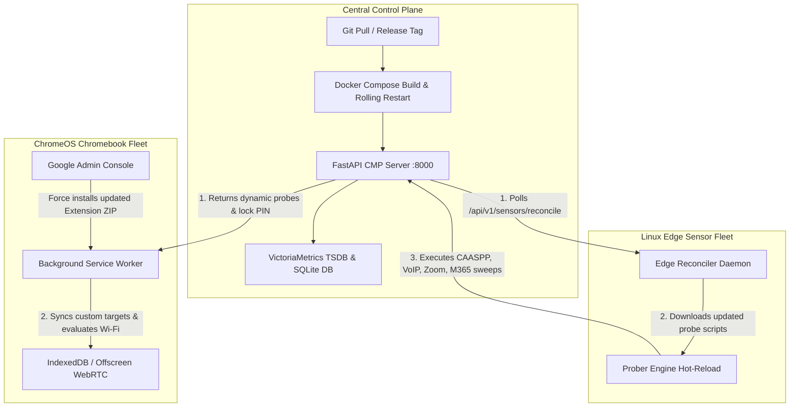

# Open Network Experience (ONE) — Admin Guide: CMP Updates & Downstream Sensor Fleet Alignment

> **Repository**: [Open Network Experience (ONE)](https://github.com/leifdavisson/Open_Network_Experience)
> **Target Audience**: District IT Directors, Network Engineers, Enterprise Systems Administrators
> **License**: GNU AGPLv3

---

## 1. Executive Summary & Update Architecture

The **Open Network Experience (ONE)** platform uses a **decoupled, two-tier update pipeline** designed for 24/7 continuous assurance across K-12 school districts and large enterprise campuses:

1. **Central Management Platform (CMP)**: Containerized control plane running on Docker / Podman, orchestrating synthetic test schedules, custom probe configurations, and alerting.
2. **Downstream Sensor Fleet**:
   - **Linux Edge Sensors** (Raspberry Pi / Mini-PC): Continuously reconciled via the automated Edge Reconciler daemon (`reconciler.py`).
   - **1:1 Chromebook Sensors** (ChromeOS): Two-stage synchronization combining real-time dynamic server pushes on every heartbeat with centralized extension packaging via Google Workspace Admin Console.



---

## 2. CMP Server Update Workflow

Follow these steps on your host server to update the Central Management Platform without losing historical metrics or database records.

### Step 1: Pre-Update Backup
Before applying code updates or schema migrations, generate an automated snapshot of the active SQLite database and configuration:

```bash
cd /data/Open_Network_Experience/server
python3 -c "import db; print('Database status:', db.get_stats())"
# Create a timestamped backup
mkdir -p /data/Open_Network_Experience/backups
cp /data/Open_Network_Experience/server/data/cmp.db /data/Open_Network_Experience/backups/cmp_$(date +%Y%m%d_%H%M%S).db
```

### Step 2: Pull Latest Code / Release Tag
```bash
cd /data/Open_Network_Experience
git pull origin main
```

### Step 3: Rebuild & Restart the CMP Container
The control plane container builds in under 2 seconds leveraging Docker layer caching:

```bash
cd /data/Open_Network_Experience/server/deploy
docker compose build cmp-server
docker compose up -d cmp-server
```

### Step 4: Validate Health & Test Suite
Verify that the updated server is live and that all backend APIs pass verification:

```bash
# 1. Health check endpoint
curl -s http://localhost:8000/health | jq .

# 2. Run full integration verification
cd /data/Open_Network_Experience/server
pytest -v
```

---

## 3. Downstream Sensor Fleet Auto-Update Pipelines

### Part A: Linux Edge Hardware Sensors (Raspberry Pi / Mini-PC)

Linux edge sensors require **zero physical touch** to receive new diagnostic tests, custom probers, or schedule changes.

#### 1. How the Reconciler Works
- Edge sensors run the daemon located at `sensor/reconciler/reconciler.py` managed as a `systemd` service (`one-sensor.service`).
- Every interval (default: 60s), the sensor checks in with `/api/v1/sensors/reconcile`.
- **Dynamic Script Distribution**: If an admin uploads or updates a synthetic test script in the CMP Web UI, the reconciler automatically downloads the updated script via `GET /api/v1/scripts/{filename}` to `/opt/one-sensor/scripts/`.
- **Zero-Downtime Hot-Reload**: The test prober dynamically re-executes tests without rebooting the Raspberry Pi or disrupting the physical network interface.

#### 2. Network Circuit Breaker & Offline Safety
If a server update causes temporary network unreachability:
- The sensor's built-in **Network Safety Guardrails** (`sensor/safety_guardrails.py`) activate.
- Edge testing pauses gracefully without triggering false-positive alerts, buffering diagnostic data locally until CMP connectivity resumes.

---

### Part B: 1:1 Chromebook Sensor Fleet (ChromeOS)

Chromebook updates are split into **Dynamic Configuration** (instant) and **Extension Binaries** (Google Admin Console).

#### 1. Instant Dynamic Updates (Zero Extension Reload)
- Every 60 seconds, the Chromebook service worker sends its RF and WebRTC metrics to `/api/v1/sensors/report`.
- The CMP server returns the active configuration in the HTTP 200 response:
  ```json
  {
    "status": "received",
    "settings_locked": true,
    "helpdesk_pin": "4357",
    "custom_probes": [
      {
        "name": "State Testing Portal",
        "target_url": "https://caaspp.org",
        "category": "Testing",
        "timeout_seconds": 5
      }
    ]
  }
  ```
- **New URLs, PIN changes, and Lock States apply immediately in memory and persist in `chrome.storage.local`.**

#### 2. Releasing New Extension Builds (Manifest V3)
When modifying extension UI panels, permissions, or background worker architecture:

1. **Package the Release ZIP**:
   ```bash
   cd /data/Open_Network_Experience/chromebook-sensor
   npm run package
   ```
   *This outputs `dist/one-chromebook-sensor-v1.0.0.zip` and `dist/google_workspace_policy_v1.0.0.json`.*

2. **Deploy via Google Workspace Admin Console**:
   - Navigate to **[Google Workspace Admin Console](https://admin.google.com)** $\rightarrow$ **Devices** $\rightarrow$ **Chrome** $\rightarrow$ **Apps & extensions** $\rightarrow$ **Users & browsers**.
   - Select your target Organizational Unit (e.g. `Students / High School`).
   - Click **+** $\rightarrow$ **Upload extension** and select the `.zip` archive from your `dist/` folder.
   - Paste the contents of `dist/google_workspace_policy_v1.0.0.json` into **Policy for extensions**.
   - Set installation policy to **Force install + pin to browser taskbar**.

3. **Silent Auto-Update**:
   - Google Workspace automatically pushes the new build to all student Chromebooks silently in the background within a few hours or on the next device login.

---

## 4. Fleet Drift & Alignment Monitoring in CMP

Administrators can monitor version alignment across all Chromebooks and edge sensors directly in the CMP Web UI:

1. Open the CMP Dashboard: `http://<server-ip>:8000`.
2. Navigate to **Fleet Management** $\rightarrow$ **💻 1:1 Chromebooks**:
   - **Version Badge**:
     - `🟢 v1.0.0 ✓` (Up to date with target server build).
     - `🟡 v0.9.0 ⚠️` (Outdated build — device needs a policy refresh).
   - **Lock Status**:
     - `🔒` **Locked** (Student protection active; local edits restricted).
     - `🔓` **Unlocked** (IT Helpdesk technician active session).

---

## 5. Official References & Companion Utilities

- **Core Framework**: [FastAPI Documentation](https://fastapi.tiangolo.com/)
- **ChromeOS Enterprise Deployment**: [Google Workspace Chrome Management Guide](https://support.google.com/chrome/a/answer/188453)
- **Time-Series Ingestion**: [VictoriaMetrics Architecture](https://victoriametrics.com/)
- **Repository & Issue Tracker**: [Open Network Experience (ONE)](https://github.com/leifdavisson/Open_Network_Experience)
