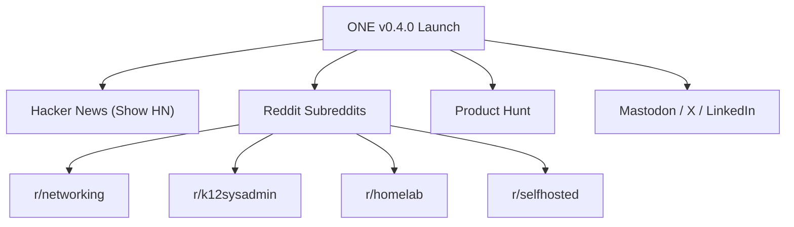

# Open Network Experience (ONE) — Community Launch Playbook & Campaign Kit
**Target Release**: `v0.4.0`
**License**: [GNU AGPLv3](file:///data/Open_Network_Experience/LICENSE) (file:///data/Open_Network_Experience/LICENSE)
**Primary Repository**: [github.com/leifdavisson/Open_Network_Experience](https://github.com/leifdavisson/Open_Network_Experience)

---

## 1. Launch Strategy & Key Channels

This launch package is formatted for direct execution across leading technology and sysadmin communities:



---

## 2. Channel Copy & Ready-to-Post Templates

### Channel 1: Hacker News — `Show HN: Open Network Experience (ONE) – Open-Source Aruba UXI Alternative`

```markdown
**Title**: Show HN: Open Network Experience (ONE) – Open-source Aruba UXI alternative

Hi HN,

We built Open Network Experience (ONE) [1] to solve a problem that has frustrated school districts, universities, and enterprise network engineers for years: commercial User Experience Insight (UXI) sensors are great, but paying $300–$800/year per sensor plus locked hardware makes full campus coverage financially impossible.

ONE is a 100% open-source (AGPLv3) synthetic network prober and fleet telemetry platform designed to run on commodity single-board computers (Raspberry Pi 4/5, Intel N100) and ChromeOS fleets.

Key Architectural Capabilities:
1. Dual-NIC Scientific Control: Runs parallel probes over wired (eth0) and wireless (wlan0) simultaneously. If eth0 is fast and wlan0 degrades, it pinpoints local RF/AP interference instantly. If both fail, it identifies an upstream core switch/WAN outage.
2. In-Memory 50MB RAM PCAP Ring Buffer: When synthetic packet loss breaches a threshold, the prober dumps raw .pcap captures to disk for forensic Wi-Fi/DHCP handshake root-cause analysis.
3. Chromebook Fleet Extension: Manifest V3 ChromeOS prober measuring WebRTC STUN latency, ITU-T G.107 E-model VoIP MOS rating, and AP roaming transitions with offline IndexedDB replay.
4. K-12 State Testing & CIPA Compliance: Pre-built probers for CAASPP / Cambium TDS / ETS TOMS with SSL Inspection Bypass validation.
5. Self-Hosted Control Plane: FastAPI control plane with SQLite SSOT, VictoriaMetrics TSDB, Loki logs, and pre-provisioned Grafana NOC dashboards.

Code & Documentation:
GitHub: https://github.com/leifdavisson/Open_Network_Experience

We'd love your feedback on the architecture, prober design, or custom probe recipes!

[1] https://github.com/leifdavisson/Open_Network_Experience
```

---

### Channel 2: Reddit — `r/k12sysadmin`

```markdown
**Title**: Built an Open-Source Aruba UXI Alternative for School Districts (CAASPP pre-flight, Chromebook telemetry, Raspberry Pi probers)

Hey everyone,

Like many of you, we love having synthetic UXI probers in our classrooms to know if Wi-Fi or testing portals are down before the morning bell rings. But with commercial sensors charging $400+/year per sensor, equipping every school wing blows out tech department budgets.

We've open-sourced **Open Network Experience (ONE)** under AGPLv3:
https://github.com/leifdavisson/Open_Network_Experience

What it does out-of-the-box:
- **CAASPP / ELPAC / Cambium Testing Pre-flight**: Continuously validates state testing reachability and verifies SSL inspection bypass so secure testing browsers don't crash.
- **ChromeOS Manifest V3 Fleet Extension**: Deploy via Google Admin Console to measure student device roaming, signal RSSI dBm, and Google Meet MOS audio quality.
- **Hardware Probers on Raspberry Pi / x86**: Dual-NIC testing (Ethernet control baseline vs Wi-Fi) with Wi-Fi DARRP/RRM channel flapping alerts.
- **Zero Cloud Subscription Fees**: Self-host the control plane with a single `docker compose up -d` (FastAPI + VictoriaMetrics + Grafana).

Everything is open source and we'd love for other district sysadmins and technicians to test it out in their labs. Feedback and PRs welcome!
```

---

### Channel 3: Reddit — `r/networking`

```markdown
**Title**: [Open Source] Open Network Experience (ONE) v0.4.0 - Distributed synthetic network prober & Wi-Fi experience monitoring

Post:
Hi r/networking,

We've released v0.4.0 of Open Network Experience (ONE), an open-source synthetic network experience monitoring system built for campus and enterprise environments.

GitHub: https://github.com/leifdavisson/Open_Network_Experience

Core highlights:
- **Dual-NIC Split-Brain Diagnostics**: Isolates L2/L3 wireless RF degradation from upstream switch fabric/WAN issues using dual-NIC interface binding.
- **Wi-Fi DARRP / RRM Flapping Monitor**: Detects aggressive dynamic radio channel switches (>3 switches/hour) and co-channel interference spikes.
- **Synthetic Transactions**: Playwright headless browser transactions with DOMContentLoaded breakdown and blocked third-party asset tracking.
- **Automated ZTP & USB Assembly Line**: Staging via FAT32 USB auto-enrollment or DHCP Option 43 discovery.
- **Full Observability Stack**: Ingests into VictoriaMetrics, Loki, and Grafana with Alertmanager webhooks.

License is GNU AGPLv3. Looking forward to your thoughts and probe feature suggestions.
```

---

### Channel 4: Reddit — `r/homelab` & `r/selfhosted`

```markdown
**Title**: Open Network Experience (ONE) – Turn any Raspberry Pi or mini-PC into an enterprise-grade synthetic network prober

Post:
Hey r/homelab / r/selfhosted,

If you’ve ever wanted an enterprise synthetic network prober (like Aruba UXI or 7SIGNAL) to continuously monitor your home or lab Wi-Fi/Ethernet SLAs, iPerf3 bandwidth, DNS resolution, and latency without paying thousands in SaaS fees:

Check out ONE (Open Network Experience):
https://github.com/leifdavisson/Open_Network_Experience

It runs the server stack in Docker (FastAPI + VictoriaMetrics + Grafana) and the edge prober on any Debian/Ubuntu machine or Raspberry Pi.

Features:
- Dual-NIC wired vs wireless differential testing
- Automated iPerf3 scheduled throughput testing
- Headless browser synthetic page load benchmarking (Playwright)
- Pre-configured Grafana 6-tier NOC dashboard
- 100% open source under AGPLv3.
```

---

### Channel 5: Product Hunt

```markdown
**Name**: Open Network Experience (ONE)
**Tagline**: Open-source synthetic network prober & Chromebook fleet monitoring
**Pricing**: Free & Open Source (AGPLv3)
**Description**:
Open Network Experience (ONE) is a vendor-neutral synthetic network performance assurance platform. Deploy on commodity Raspberry Pis, mini-PCs, or 1:1 Chromebook fleets to continuously monitor Wi-Fi RF quality, web application response times, and state testing readiness with zero recurring subscription fees.
```
