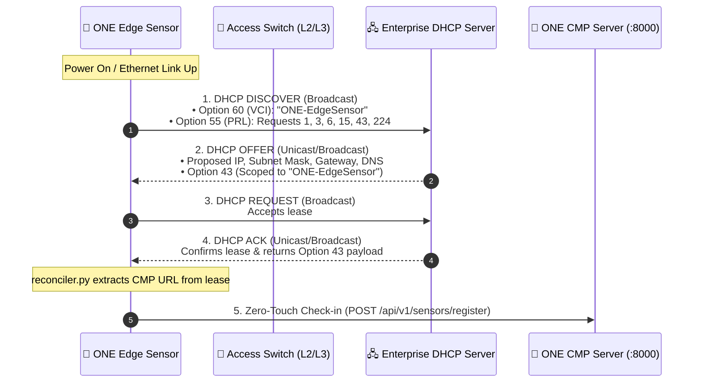
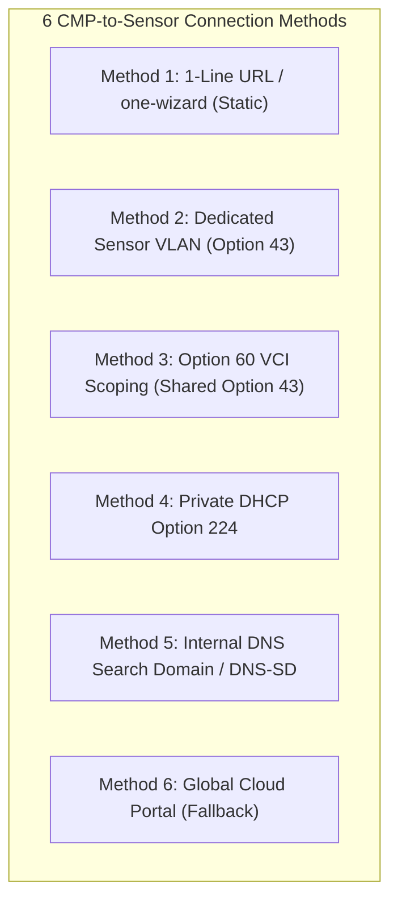
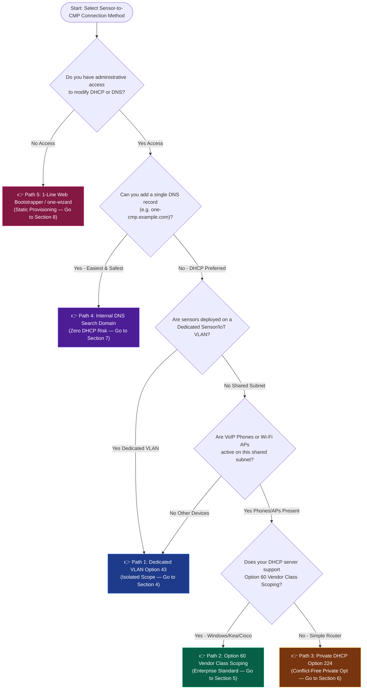
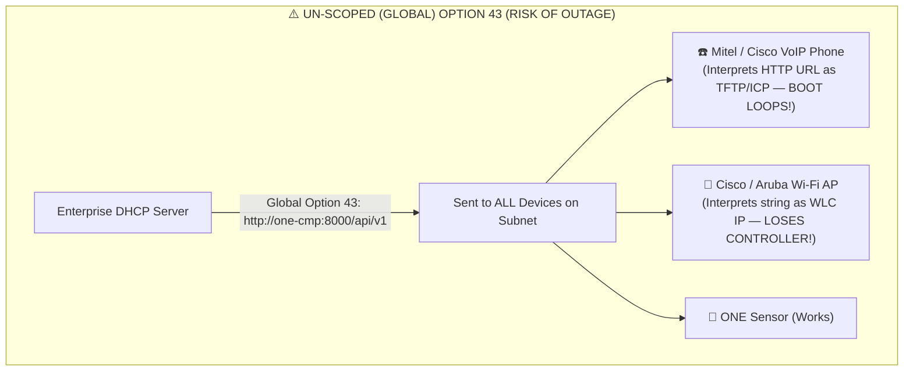
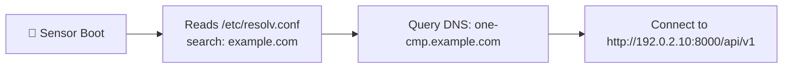
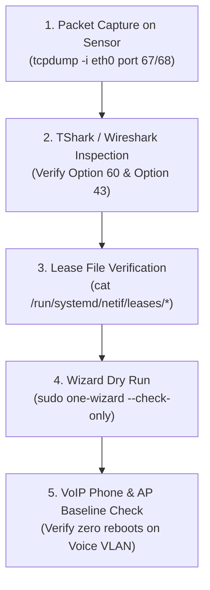

# Open Network Experience (ONE) — Sensor-to-CMP Connection & Zero-Touch Discovery Guide

> **Target Audience**: School District Network Administrators, System Engineers, and NOC Field Technicians.
> **Prerequisites**: Fundamental understanding of IP subnets and enterprise LAN architectures.
> **Default License**: [GNU AGPLv3](https://www.gnu.org/licenses/agpl-3.0.html).

---

## Table of Contents
1. [First Principles: How Edge Sensors Discover the CMP](#1-first-principles-how-edge-sensors-discover-the-cmp)
2. [Connection Trade-Offs & Architectural Decision Tree](#2-connection-trade-offs--architectural-decision-tree)
   - [A. Deep-Dive: Comparing the 6 Connection Methods](#a-deep-dive-comparing-the-6-connection-methods)
   - [B. Comprehensive Pros & Cons Matrix](#b-comprehensive-pros--cons-matrix)
   - [C. Interactive Architectural Decision Tree](#c-interactive-architectural-decision-tree)
   - [D. Cautionary Analysis: VoIP Phones & Access Point Collisions](#d-cautionary-analysis-voip-phones--access-point-collisions)
3. [Encapsulation & Payload Specifications (ASCII & RFC 2132 TLV)](#3-encapsulation--payload-specifications-ascii--rfc-2132-tlv)
4. [Path 1 Walkthrough: Dedicated Sensor VLAN (Option 43)](#4-path-1-walkthrough-dedicated-sensor-vlan-option-43)
5. [Path 2 Walkthrough: Option 60 Vendor Class Scoping (Shared Subnet Option 43)](#5-path-2-walkthrough-option-60-vendor-class-scoping-shared-subnet-option-43)
   - [Windows Server DHCP](#windows-server-dhcp-option-60)
   - [Linux ISC Kea DHCP](#linux-isc-kea-dhcp-option-60)
   - [Linux ISC DHCPd (Legacy)](#linux-isc-dhcpd-legacy-option-60)
   - [dnsmasq](#dnsmasq-option-60)
   - [Cisco IOS-XE / Catalyst](#cisco-ios-xe--catalyst-option-60)
   - [Fortinet FortiGate (FortiOS)](#fortinet-fortigate-fortios-option-60)
   - [MikroTik RouterOS](#mikrotik-routeros-option-60)
   - [Infoblox NIOS](#infoblox-nios-option-60)
6. [Path 3 Walkthrough: Private DHCP Option 224 (Site-Specific Option)](#6-path-3-walkthrough-private-dhcp-option-224-site-specific-option)
7. [Path 4 Walkthrough: Internal DNS Search Domain & DNS-SD](#7-path-4-walkthrough-internal-dns-search-domain--dns-sd)
8. [Path 5 Walkthrough: 1-Line Web Bootstrapper & Interactive `one-wizard`](#8-path-5-walkthrough-1-line-web-bootstrapper--interactive-one-wizard)
9. [Step-by-Step Validation & Confidence Building Protocol](#9-step-by-step-validation--confidence-building-protocol)
10. [Troubleshooting, Diagnostics & Emergency Rollback](#10-troubleshooting-diagnostics--emergency-rollback)

---

## 1. First Principles: How Edge Sensors Discover the CMP

When a new edge sensor (Raspberry Pi, x86 SBC, or Intel Mini PC) powers on in a school classroom or network closet, it has no static configuration. To begin monitoring synthetic SaaS, VoIP, and Wi-Fi SLAs, it must discover the **Central Monitoring Platform (CMP)** control plane.

The sensor accomplishes this using the four-step **DHCP DORA (Discover, Offer, Request, Acknowledge)** transaction ([RFC 2131](https://datatracker.ietf.org/doc/html/rfc2131)):



### Core DHCP Protocol Concepts:
* **Option 53 (Message Type)**: Identifies whether the packet is a Discover, Offer, Request, or ACK.
* **Option 55 (Parameter Request List / PRL)**: The client's "wishlist" sent to the server. The ONE sensor explicitly requests Options `1` (Subnet), `3` (Router), `6` (DNS), `15` (Domain Name), `43` (Vendor Information), and `224` (Private Site Option).
* **Option 60 (Vendor Class Identifier / VCI)**: The **identity badge** sent by the client (`"ONE-EdgeSensor"`). Allows the DHCP server to distinguish a network sensor from a Mitel phone, a Windows laptop, or a Cisco AP.
* **Option 43 (Vendor Specific Information)**: The **payload container** returned by the server containing the CMP endpoint URL.
* **Option 224 (Private Use / Site-Specific)**: An alternate private option ([RFC 3942](https://datatracker.ietf.org/doc/html/rfc3942)) to completely avoid Option 43 shared-vendor namespaces.
* **Option 15 (Domain Name)**: The local DNS suffix (e.g. `example.com`) used for hostname discovery.

---

## 2. Connection Trade-Offs & Architectural Decision Tree

### A. Deep-Dive: Comparing the 6 Connection Methods

There are six distinct ways to connect ONE Edge Sensors to your CMP control plane. Each method has unique operational trade-offs:



#### Method 1: 1-Line URL Bootstrapper & Interactive `one-wizard` (Static Config)
* **How it Works**: A field technician runs `curl -sSL "http://<cmp>:8000/install.sh?site=West+High&room=204" | sudo bash` or launches `sudo one-wizard`.
* **Pros**:
  - 100% deterministic and predictable; requires zero DHCP or DNS changes.
  - Allows technicians to input exact classroom numbers, drop IDs, and Wi-Fi credentials during installation.
  - Works over any network (cellular hotspots, isolated lab switches, unmanaged drops).
* **Cons**:
  - Not zero-touch; requires a technician to SSH or open a console on initial setup.

#### Method 2: Dedicated Sensor VLAN Scope (Option 43)
* **How it Works**: Sensors are patched into a dedicated Management/IoT VLAN (e.g. VLAN 20). Option 43 is configured on that subnet's DHCP scope without filtering.
* **Pros**:
  - 100% Zero-Touch: Just plug the sensor in and it registers automatically.
  - **Zero VoIP/AP collision risk** because phones and APs reside on separate voice/infra VLANs.
  - Extremely simple to configure on any router or switch.
* **Cons**:
  - Requires physical patch cables or switchports to be untagged/assigned to the Sensor VLAN.

#### Method 3: Option 60 Vendor Class Scoping (Shared Subnet Option 43)
* **How it Works**: Sensors share standard classroom/office subnets with computers and phones. The DHCP server inspects Option 60 (`"ONE-EdgeSensor"`) and **only** delivers Option 43 to ONE sensors.
* **Pros**:
  - 100% Zero-Touch on any switchport or shared classroom drop.
  - Completely prevents VoIP phones (Mitel, Cisco, Polycom) from seeing or misinterpreting the Option 43 payload.
* **Cons**:
  - Requires a DHCP server that supports Option 60 vendor class matching ([Microsoft DHCP](https://learn.microsoft.com/en-us/windows-server/networking/technologies/dhcp/dhcp-top), [ISC Kea](https://www.isc.org/kea/), [dnsmasq](https://thekelleys.org.uk/dnsmasq/doc.html), Cisco IOS).

#### Method 4: Private DHCP Option 224 (Site-Specific Option)
* **How it Works**: The DHCP server delivers the CMP URL in RFC 3942 Private Option Code `224` or `225`.
* **Pros**:
  - Completely bypasses Option 43, eliminating all potential vendor collisions mathematically.
  - Does not require complex Option 60 regex rules.
* **Cons**:
  - Requires creating a custom option definition on the DHCP server.

#### Method 5: Internal DNS Search Domain & DNS-SD (`one-cmp.<domain>`)
* **How it Works**: An `A` record for `openux-cmp.<domain>` or `one-cmp.<domain>` is added to the district's internal DNS server. The sensor resolves it automatically via Option 15.
* **Pros**:
  - **Zero DHCP configuration required**.
  - A single DNS record enables zero-touch discovery across hundreds of schools and thousands of subnets.
  - Zero impact on VoIP phones, APs, or existing DHCP options.
* **Cons**:
  - Requires access to internal DNS zones; all sensors must have L3 IP routing to the CMP server IP.

#### Method 6: Global Public Cloud Portal (`discovery.openux.org`)
* **How it Works**: If all local DHCP and DNS discovery mechanisms return empty, the sensor phones home to the global discovery cloud portal to resolve its assigned CMP tenant.
* **Pros**:
  - Zero configuration; works when shipping sensors directly from factory to remote sites.
* **Cons**:
  - Requires outbound internet connectivity over port 443 during boot.

---

### B. Comprehensive Pros & Cons Matrix

| Connection Method | Zero-Touch? | DHCP Changes? | DNS Changes? | VoIP Collision Risk | Best Suited For |
| :--- | :---: | :---: | :---: | :---: | :--- |
| **Method 1: 1-Line URL / `one-wizard`** | ❌ No (Manual) | None | None | **Zero (0%)** | Lab setups, initial proof-of-concepts, single sensor deployments. |
| **Method 2: Dedicated Sensor VLAN (Opt 43)** | ✅ **Yes** | Scope Only | None | **Zero (0%)** | Districts with segregated IoT/Management VLANs. |
| **Method 3: Option 60 Vendor Class (Opt 43)** | ✅ **Yes** | Class Match | None | **Zero (0%)** | Shared subnets where sensors plug into general student/staff ports. |
| **Method 4: Private DHCP Option 224** | ✅ **Yes** | Custom Opt | None | **Zero (0%)** | Environments where Option 43 is already claimed by Aruba/Cisco APs. |
| **Method 5: Internal DNS (`one-cmp`)** | ✅ **Yes** | None | 1 `A` Record | **Zero (0%)** | **Recommended enterprise standard** across multi-campus networks. |
| **Method 6: Global Cloud Portal** | ✅ **Yes** | None | None | **Zero (0%)** | Factory direct-to-school unboxing without local staging. |

---

### C. Interactive Architectural Decision Tree

Use this decision tree to identify the ideal implementation path for your environment:



---

### D. Cautionary Analysis: VoIP Phones & Access Point Collisions

> [!CAUTION]
> **CRITICAL WARNING FOR NETWORK ADMINISTRATORS**:
> Never configure Option 43 globally at the root or server level without Option 60 Vendor Class Scoping if VoIP phones or Wi-Fi APs share that DHCP server!



#### Detailed Breakdown of Vendor Collisions:
1. **Mitel / ShoreTel IP Phones (MiVoice / ICP)**:
   - Mitel phones rely on Option 43 Sub-Options 128 (TFTP Server), 129 (RTP Server), 130 (Phone IP), 132 (VLAN ID), and 133 (QoS Priority).
   - **Failure Mode**: When receiving an un-scoped text string, Mitel phones fail to parse it as IP addresses, drop TFTP configuration, and enter **continuous reboot loops**, taking classroom and office phones offline.
2. **Cisco Unified IP Phones (CUCM / CallManager)**:
   - Cisco phones typically use Option 150, but certain firmware models fall back to Option 43 sub-option 150.
   - **Failure Mode**: Phones get stuck on *"Configuring IP"* or *"TFTP Timeout"*.
3. **Polycom (Poly) VVX Conference & Desk Phones**:
   - Query Option 43 / 66 for provisioning server URLs.
   - **Failure Mode**: Phones fail SIP registration and cannot place or receive calls.
4. **Cisco Catalyst / Aironet Wi-Fi APs (CAPWAP / WLC)**:
   - APs query Option 43 expecting **Type-Length-Value (TLV) Type `0xf1` (241)** containing the 4-byte IP address of the Wireless LAN Controller (WLC).
   - **Failure Mode**: APs fail CAPWAP discovery and **drop all school broadcast SSIDs**.
5. **Aruba / HPE Instant APs & Central**:
   - Aruba APs query Option 43 for AirWave or Aruba Central URLs (`<ArubaGroup>,<ArubaKey>,<AMP-IP>`).

---

## 3. Encapsulation & Payload Specifications (ASCII & RFC 2132 TLV)

The ONE Edge Sensor reconciler daemon ([`sensor/reconciler/reconciler.py`](file:///data/Open_Network_Experience/sensor/reconciler/reconciler.py)) automatically recognizes two encapsulation formats:

### Format A: Plain ASCII URL String
The simplest format. The Option 43 or Option 224 value is directly formatted as an ASCII string:
```text
http://192.0.2.10:8000/api/v1
```

### Format B: RFC 2132 Sub-Option TLV (Type-Length-Value)
For advanced deployments that wish to automatically provision Campus, Building, and Room tags directly from DHCP:

```text
+-------------------+--------------------+---------------------------------------+
| Sub-Option Code   | Field Name         | Example Value                         |
+-------------------+--------------------+---------------------------------------+
| 0x01 (1)          | CMP Server URL     | http://192.0.2.10:8000/api/v1        |
| 0x02 (2)          | Campus / Site Name | West High School                      |
| 0x03 (3)          | Building Name      | Science Wing                          |
| 0x04 (4)          | Room / Drop ID     | Room 204                              |
| 0x05 (5)          | Enrollment Token   | ztp-sec-token-9988                    |
+-------------------+--------------------+---------------------------------------+
```

#### Example Hex Stream:
`01:1d:68:74:74:70:3a:2f:2f:31:39:32:2e:30:2e:32:2e:31:30:3a:38:30:30:30:2f:61:70:69:2f:76:31:02:09:57:65:73:74:20:48:69:67:68`

---

## 4. Path 1 Walkthrough: Dedicated Sensor VLAN (Option 43)

If you follow **Path 1** from the decision tree, edge sensors are patched into a dedicated VLAN (e.g. VLAN 20 - `198.51.100.0/24`). Because VoIP phones and APs are not present on this subnet, you can configure Option 43 directly on the scope.

### Microsoft Windows Server DHCP (Scope Option)
```powershell
Set-DhcpServerv4OptionValue -ScopeId 198.51.100.0 -OptionId 43 -Value "http://192.0.2.10:8000/api/v1"
```

### Cisco IOS-XE Switch
```cisco
ip dhcp pool SENSOR_VLAN20_POOL
   network 198.51.100.0 255.255.255.0
   default-router 198.51.100.1
   dns-server 198.51.100.10
   option 43 ascii "http://192.0.2.10:8000/api/v1"
```

---

## 5. Path 2 Walkthrough: Option 60 Vendor Class Scoping (Shared Subnet Option 43)

If you follow **Path 2** from the decision tree, sensors share subnets with phones and computers. The DHCP server inspects Option 60 (`"ONE-EdgeSensor"`) and only delivers Option 43 when matched.

### Windows Server DHCP (Option 60)
Run in an elevated PowerShell prompt on your Domain Controller:

```powershell
# 1. Define the Vendor Class Identifier for ONE Edge Sensors
Add-DhcpServerv4Class -Name "ONE-EdgeSensor" -Type Vendor -Data "ONE-EdgeSensor" -Description "Open Network Experience Edge Sensors"

# 2. Define Option 43 under this Vendor Class as a String
Add-DhcpServerv4OptionDefinition -VendorClass "ONE-EdgeSensor" -OptionId 43 -Name "ONE_CMP_URL" -Type String -Description "Central Monitoring Platform URL"

# 3. Assign the Option Value to your target Scope ID (e.g. 198.51.100.0)
Set-DhcpServerv4OptionValue -ScopeId 198.51.100.0 -VendorClass "ONE-EdgeSensor" -OptionId 43 -Value "http://192.0.2.10:8000/api/v1"
```

### Linux ISC Kea DHCP (Option 60)
Edit `/etc/kea/kea-dhcp4.conf`:

```json
{
  "Dhcp4": {
    "client-classes": [
      {
        "name": "ONE_SENSOR",
        "test": "option[60].text == 'ONE-EdgeSensor'",
        "option-data": [
          {
            "name": "vendor-encapsulated-options",
            "code": 43,
            "data": "http://192.0.2.10:8000/api/v1"
          }
        ]
      }
    ],
    "subnet4": [
      {
        "subnet": "198.51.100.0/24",
        "pools": [{ "pool": "10.200.4.50 - 10.200.4.200" }]
      }
    ]
  }
}
```

### Linux ISC DHCPd Legacy (Option 60)
Edit `/etc/dhcp/dhcpd.conf`:

```conf
class "one-sensors" {
    match if option vendor-class-identifier = "ONE-EdgeSensor";
    option vendor-encapsulated-options "http://192.0.2.10:8000/api/v1";
}

subnet 198.51.100.0 netmask 255.255.255.0 {
    range 10.200.4.50 10.200.4.200;
    option routers 198.51.100.1;
    option domain-name-servers 198.51.100.10;
}
```

### dnsmasq (Option 60)
Edit `/etc/dnsmasq.conf`:

```conf
# Identify ONE Sensors via Option 60
dhcp-vendorclass=set:onesensor,ONE-EdgeSensor

# Deliver Option 43 ONLY to matched devices
dhcp-option=tag:onesensor,43,"http://192.0.2.10:8000/api/v1"
```

### Cisco IOS-XE / Catalyst (Option 60)
```cisco
! Match Option 60 ASCII "ONE-EdgeSensor" (Hex: 4f4e452d4564676553656e736f72)
ip dhcp class ONE_SENSORS
   match option 60 hex 4f4e452d4564676553656e736f72

! Apply Option 43 within DHCP Pool
ip dhcp pool CLASSROOM_POOL
   network 198.51.100.0 255.255.255.0
   default-router 198.51.100.1
   class ONE_SENSORS
      option 43 ascii "http://192.0.2.10:8000/api/v1"
```

### Fortinet FortiGate FortiOS (Option 60)
```fortios
config system dhcp server
    edit 1
        set default-gateway 198.51.100.1
        set netmask 255.255.255.0
        set interface "vlan20"
        config options
            edit 1
                set code 43
                set type string
                set value "http://192.0.2.10:8000/api/v1"
                set vci-string "ONE-EdgeSensor"
            next
        end
    next
end
```

### MikroTik RouterOS (Option 60)
```routeros
/ip dhcp-server option
add name=one_cmp_opt43 code=43 value="'http://192.0.2.10:8000/api/v1'"

/ip dhcp-server option matcher
add name=one_matcher code=60 value="ONE-EdgeSensor" option-set=one_set

/ip dhcp-server option set
add name=one_set options=one_cmp_opt43
```

### Infoblox NIOS (Option 60)
1. Go to **Data Management** > **DHCP** > **Custom DHCP Options**.
2. Create Vendor Class `ONE-EdgeSensor` with Option `43` as `String`.
3. Apply to target IPv4 Network.

---

## 6. Path 3 Walkthrough: Private DHCP Option 224 (Site-Specific Option)

If you follow **Path 3** from the decision tree, you avoid Option 43 entirely by utilizing RFC 3942 Private Option `224`.

### Microsoft Windows Server DHCP (Option 224)
```powershell
Add-DhcpServerv4OptionDefinition -OptionId 224 -Name "ONE_CMP_URL_PRIVATE" -Type String -Description "ONE CMP Private Option"
Set-DhcpServerv4OptionValue -ScopeId 198.51.100.0 -OptionId 224 -Value "http://192.0.2.10:8000/api/v1"
```

### Linux ISC Kea DHCP (`kea-dhcp4.conf`)
```json
{
  "name": "site-option-224",
  "code": 224,
  "data": "http://192.0.2.10:8000/api/v1"
}
```

---

## 7. Path 4 Walkthrough: Internal DNS Search Domain & DNS-SD

If you follow **Path 4** from the decision tree, you make **zero DHCP modifications**. You add a single DNS `A` record to your internal DNS server.



### Windows Server DNS (PowerShell)
```powershell
Add-DnsServerResourceRecordA -ZoneName "example.com" -Name "one-cmp" -IPv4Address "192.0.2.10"
Add-DnsServerResourceRecordA -ZoneName "example.com" -Name "openux-cmp" -IPv4Address "192.0.2.10"
```

### Linux BIND9 (`/etc/bind/db.example.com`)
```bind
one-cmp.example.com.    IN  A   192.0.2.10
openux-cmp.example.com. IN  A   192.0.2.10
```

---

## 8. Path 5 Walkthrough: 1-Line Web Bootstrapper & Interactive `one-wizard`

If you follow **Path 5** from the decision tree, you use static or semi-automated provisioning.

### 1-Line Web Bootstrapper (With URL Presets)
```bash
curl -sSL "http://192.0.2.10:8000/install.sh?site=West+High+School&room=Room+204&building=Science+Wing" | sudo bash
```

### Interactive Terminal Setup Wizard (`one-wizard`)
```bash
# Launch interactive terminal setup
sudo one-wizard
```
The wizard guides technicians step-by-step through interface detection, CMP reachability tests, campus/room tagging, Wi-Fi site surveys, and instant ZTP registration checks.

---

## 9. Step-by-Step Validation & Confidence Building Protocol

Follow this 5-step validation protocol before district-wide deployment:



### Step 1: Pre-Flight Packet Capture on Sensor
```bash
sudo tcpdump -vvv -n -i eth0 port 67 or port 68 -w /tmp/dhcp_discovery.pcap
```
Renew the DHCP lease:
```bash
sudo networkctl reconfigure eth0 || (sudo dhclient -r && sudo dhclient eth0)
```

### Step 2: Inspect with [TShark](https://www.wireshark.org/)
```bash
tshark -r /tmp/dhcp_discovery.pcap -Y "bootp" -V | grep -A 4 -E "Option: \(43\)|Option: \(60\)"
```

### Step 3: Inspect Local Sensor Lease File
```bash
cat /run/systemd/netif/leases/* | grep -E "OPTION_43|vendor"
```

### Step 4: Run Diagnostic Dry-Run with `one-wizard`
```bash
sudo one-wizard --check-only
```
**Expected Output**:
```text
✔ Auto-discovered CMP endpoint: http://192.0.2.10:8000/api/v1 (via DHCP Option 43)
✔ Connection Successful! (1.4 ms latency, HTTP 200 OK)
```

### Step 5: Verify VoIP Phone & AP Baseline
Confirm that adjacent Cisco/Mitel phones or Wi-Fi APs maintain active registrations without rebooting.

---

## 10. Troubleshooting, Diagnostics & Emergency Rollback

| Symptom | Probable Cause | Immediate Remediation |
| :--- | :--- | :--- |
| **Mitel / Cisco phone reboots continuously** | Option 43 was applied globally without Option 60 scoping. | **Rollback immediately**: Remove Option 43 from default scope. Switch to **Path 2 (Option 60)** or **Path 4 (DNS)**. |
| **Sensor falls back to `discovery.openux.org`** | Option 43 missing from DHCP ACK or lease file directory permissions issue. | Verify Option 55 in client request; check `cat /run/systemd/netif/leases/*`. |
| **`HTTP 404` or connection refused** | Port `8000` or `/api/v1` omitted from URL string. | Ensure Option 43 contains full URL (e.g. `http://<ip>:8000/api/v1`). |
| **DHCP server rejects Option 43 as ASCII** | Server requires Hex format (e.g. Cisco IOS / MikroTik). | Convert URL to hex: `python3 -c "print(''.join(hex(ord(c))[2:] for c in 'http://...'))"`. |

---

## 11. Reference Documentation Links
- [RFC 2131: Dynamic Host Configuration Protocol](https://datatracker.ietf.org/doc/html/rfc2131)
- [RFC 2132: DHCP Options and BOOTP Vendor Extensions](https://datatracker.ietf.org/doc/html/rfc2132)
- [RFC 3942: Reclassifying DHCP Options](https://datatracker.ietf.org/doc/html/rfc3942)
- [Microsoft Windows Server DHCP Guide](https://learn.microsoft.com/en-us/windows-server/networking/technologies/dhcp/dhcp-top)
- [ISC Kea Administrator Reference Manual](https://kea.readthedocs.io/)
- [Wireshark & TShark Packet Analysis](https://www.wireshark.org/docs/)
