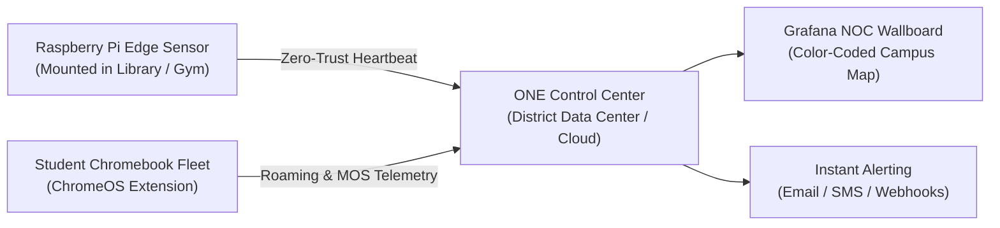

# Open Network Experience (ONE) — Executive 1-Pager
### High-Assurance Synthetic Network Assurance for School District Leadership
**Release**: `v0.4.0` | **License**: [GNU AGPLv3 (Free & Open Source)](file:///data/Open_Network_Experience/LICENSE) (file:///data/Open_Network_Experience/LICENSE)
**Project Repository**: [github.com/leifdavisson/Open_Network_Experience](https://github.com/leifdavisson/Open_Network_Experience)

---

## 📌 The Challenge
School networks face extreme demands: 1:1 student Chromebook fleets, digital state testing (CAASPP / ELPAC / Smarter Balanced), interactive classroom displays, and CIPA compliance filters. When Wi-Fi buffers or testing portals fail, students lose instructional time and IT helpdesks are overwhelmed with vague "the internet is slow" complaints.

Commercial network probers (Aruba UXI, 7SIGNAL) solve this by placing physical sensors in classrooms—but charge **hundreds of dollars per sensor every year**, costing mid-sized districts over **$200,000+ across 5 years**.

---

## 🚀 The Solution: Open Network Experience (ONE)
**ONE** is an open-source, enterprise-grade synthetic network monitoring platform built specifically for educational institutions and campus environments. It continuously tests your network **from the student and teacher perspective 24/7/365** before the school day begins.

---

## 🌟 Top 5 Strategic District Benefits

### 1. 97%+ Budget Reduction — Reinvest Taxpayer Dollars in the Classroom
Eliminates annual recurring software license fees. Runs on standard off-the-shelf single-board computers (Raspberry Pi 4/5, Intel NUCs) costing under $100 per device with zero per-sensor annual fees.

### 2. State Testing Assurance (CAASPP, Cambium TDS, ETS TOMS)
Automated pre-flight testing runs 7 days a week, verifying reachability, DNS lookup speed, and certificate pinning integrity across official state assessment servers—preventing mid-exam student lockouts.

### 3. Native 1:1 Chromebook Fleet Visibility
Includes a lightweight, privacy-focused ChromeOS Manifest V3 extension deployable across 10,000+ student devices via Google Workspace Admin Console in under 2 minutes. Tracks Wi-Fi roaming drops, signal RSSI dBm, and Google Meet WebRTC voice scores (MOS).

### 4. Zero-Trust Security & CIPA Content Filtering Audits
Validates school firewall policies (CSAM, pornography, bypass proxies) automatically while maintaining strict student privacy. ONE generates synthetic test traffic only and never collects, inspects, or logs student browsing history.

### 5. Rapid Assembly-Line Hardware Deployment
Equipped with FAT32 USB auto-provisioning and DHCP Option 43 discovery. Field technicians can unbox 50 sensors, insert a staging thumb drive, and have them auto-enrolled and reporting on the central campus map in under 30 minutes.

---

## 📊 Summary Comparison at a Glance

| Metric | Commercial Solutions | Open Network Experience (ONE) |
| :--- | :--- | :--- |
| **5-Year District TCO (45 sensors + 5,000 devices)** | $210,000+ | **Under $5,000 (Hardware Only)** |
| **Vendor Lock-In** | High (Proprietary Hardware/Cloud) | **Zero (100% AGPLv3 Open Source)** |
| **Deployment Time** | Weeks (Cloud Portal Licensing) | **Minutes (Docker + 1-Line Installer)** |
| **Student Privacy Risk** | Third-party cloud vendor storage | **100% Local Self-Hosted Control** |

---

### Contact & Next Steps
To schedule a pilot demonstration or deploy ONE in your test lab:
- Technical Documentation: [**`GETTING_STARTED.md`**](file:///data/Open_Network_Experience/GETTING_STARTED.md) (file:///data/Open_Network_Experience/GETTING_STARTED.md)
- Complete Cost & Feature Analysis: [**`COMPARISON_ARUBA_UXI_7SIGNAL.md`**](file:///data/Open_Network_Experience/docs/COMPARISON_ARUBA_UXI_7SIGNAL.md) (file:///data/Open_Network_Experience/docs/COMPARISON_ARUBA_UXI_7SIGNAL.md)
