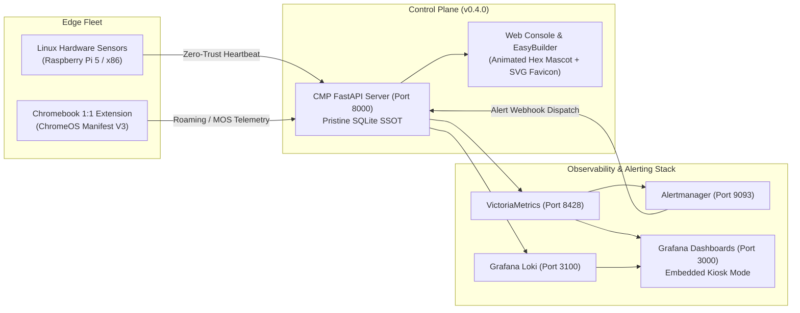

# Open Network Experience (ONE) — Project Handoff: Active Alert Panel & Alert Log
**Current Release**: `v0.4.0`
**License**: [GNU AGPLv3](file:///data/Open_Network_Experience/LICENSE) (file:///data/Open_Network_Experience/LICENSE)
**Repository**: [github.com/leifdavisson/Open_Network_Experience](https://github.com/leifdavisson/Open_Network_Experience)
**Handoff Date**: 2026-08-30

---

## 1. Executive Summary & Verified Baseline

All branding, visual art assets, SVG vector marks, CSS-animated emblems, database seeding, and Grafana iframe embedding integrations are **100% verified, clean, and operational** on release `v0.4.0`:



### Verified Engineering Gates:
- **Pytest**: `310 / 310 passed` (100% green across all probers, schedulers, and control plane endpoints).
- **Node.js ChromeOS Suite**: `16 / 16 passed`.
- **Branding Suite Complete**:
  - [Open `logo.svg`](file:///data/Open_Network_Experience/assets/logo.svg) (`file:///data/Open_Network_Experience/assets/logo.svg`) — "The Synthetic Hex Pulse"
  - [Open `logo-animated.svg`](file:///data/Open_Network_Experience/assets/branding/logo-animated.svg) (`file:///data/Open_Network_Experience/assets/branding/logo-animated.svg`) — Multi-piece CSS keyframe animations
  - [Open `favicon.svg`](file:///data/Open_Network_Experience/assets/favicon.svg) (`file:///data/Open_Network_Experience/assets/favicon.svg`) — 32x32 simplified hex tab icon
  - [Open `banner.sh`](file:///data/Open_Network_Experience/scripts/banner.sh) (`file:///data/Open_Network_Experience/scripts/banner.sh`) — ANSI terminal CLI banner
  - [Open `one_hero_banner.svg`](file:///data/Open_Network_Experience/assets/images/one_hero_banner.svg) (`file:///data/Open_Network_Experience/assets/images/one_hero_banner.svg`) — Pure vector NOC hero banner
  - [Open `one_social_preview.svg`](file:///data/Open_Network_Experience/assets/images/one_social_preview.svg) (`file:///data/Open_Network_Experience/assets/images/one_social_preview.svg`) — 1200x630 OpenGraph card
- **Clean Database**: Local `server/data/cmp.db` and container volume `/app/data/cmp.db` seeded with West High School (`CAMPUS-WEST-HIGH`), Science Wing auto-enrollment subnet, and 2 active probers.
- **Grafana Live Embedding**: `GF_SECURITY_ALLOW_EMBEDDING=true` enabled; all 5 NOC JSON dashboards provisioned and loading cleanly without connection refusals.

---

## 2. Feature Specification for the Next Conversation: Active Alert Panel & Alert Log

In the next session, we will implement a full-featured **Active Alert Panel and Open/Closed Alert Lifecycle Log** integrated into the **Monitor** section of the CMP Web Console:

```mermaid
mindmap
  root((Active Alert Panel & Log))
    Backend Control Plane
      Alertmanager Webhook Receiver
      SQLite alerts Table Schema
      Alert Deduplication & Fingerprinting
      Alert Status Lifecycle (FIRING, ACKNOWLEDGED, RESOLVED)
      REST API Endpoints (GET /alerts, POST /alerts/{id}/ack, POST /alerts/{id}/resolve)
    Frontend UI (Monitor Bucket)
      Active Alarms Triage Banner (NOC Overview)
      Dedicated Alert Center View (nav-monitor-alerts)
      Filterable Log (Open / Acknowledged / Closed / All)
      Severity Badges (Critical Rose, Warning Amber, Info Cyan)
      Forensic Drilldown & PCAP Evidence Link
```

### Key Technical Requirements to Implement:

1. **Database Schema (`alerts` table in `server/db.py`)**:
   ```sql
   CREATE TABLE IF NOT EXISTS alerts (
       id TEXT PRIMARY KEY,
       fingerprint TEXT NOT NULL,
       status TEXT NOT NULL,          -- 'firing', 'acknowledged', 'resolved'
       severity TEXT NOT NULL,        -- 'critical', 'warning', 'info'
       title TEXT NOT NULL,
       description TEXT,
       sensor_id TEXT,
       campus_id TEXT,
       probe_id TEXT,
       starts_at INTEGER NOT NULL,
       ends_at INTEGER,
       acknowledged_at INTEGER,
       acknowledged_by TEXT,
       resolution_notes TEXT,
       evidence_id TEXT,
       raw_labels_json TEXT,
       raw_annotations_json TEXT,
       updated_at INTEGER
   );
   ```

2. **Backend API Endpoints (`server/routers/alerts.py` or `server/routers/telemetry.py`)**:
   - `POST /api/v1/alerts/webhook`: Ingestion receiver for [Prometheus Alertmanager](https://prometheus.io/docs/alerting/latest/alertmanager/) webhook payloads. Automatically dedupes by fingerprint, updates status (`firing` vs `resolved`), and links matching sensors/campuses.
   - `GET /api/v1/alerts`: Returns list of alerts with query filters (`status=active`, `status=closed`, `severity=critical`, `campus_id=...`, `limit=100`).
   - `POST /api/v1/alerts/{alert_id}/acknowledge`: Sets status to `acknowledged`, records user identity and timestamp.
   - `POST /api/v1/alerts/{alert_id}/resolve`: Manually closes/resolves an alarm with optional resolution notes.
   - `GET /api/v1/alerts/summary`: Returns aggregate counts (`open_count`, `critical_count`, `warning_count`, `resolved_24h_count`).

3. **Frontend UI in [`dashboard.html`](file:///data/Open_Network_Experience/server/templates/dashboard.html)**:
   - **Monitor Sidebar Navigation**: Add `nav-monitor-alerts` ("🚨 Alert Center") under `1. Monitor` (or update existing NOC overview / reports).
   - **Active Alert Bar / KPI Badge**: Floating badge showing live open alarm count with pulsing amber/rose indicator.
   - **Interactive Triage Table**:
     - Columns: `Severity`, `Alert Name`, `Campus / Sensor`, `Trigger Reason`, `Active Duration`, `Status`, `Quick Actions`.
     - Filter tabs: `[🚨 Active Firing (N)]`, `[👁️ Acknowledged (N)]`, `[✅ Closed / Resolved]`, `[All History]`.
     - Actions: `👁️ Ack`, `✅ Resolve`, `📦 View PCAP Evidence`, `🔬 Run Diagnostics`.

4. **Integration with Existing Alertmanager Config**:
   - Configure [`server/deploy/alertmanager.yml`](file:///data/Open_Network_Experience/server/deploy/alertmanager.yml) to include a webhook receiver pointing to `http://cmp-server:8000/api/v1/alerts/webhook`.

---

## 3. Suggested Prompt to Start Your New Conversation:

```text
"I am starting a new session to build the Active Alert Panel and Open/Closed Alert Lifecycle Log for Open Network Experience (ONE) v0.4.0. Please read the handoff document at file:///home/leifdavisson/.gemini/antigravity-cli/brain/e610fbf2-7e1e-42c2-a69d-a2a458adffb2/HANDOFF_ACTIVE_ALERTS_PANEL.md and let's implement the Alertmanager webhook receiver, SQLite alerts schema, and the interactive Alert Center view under the Monitor section."
```
