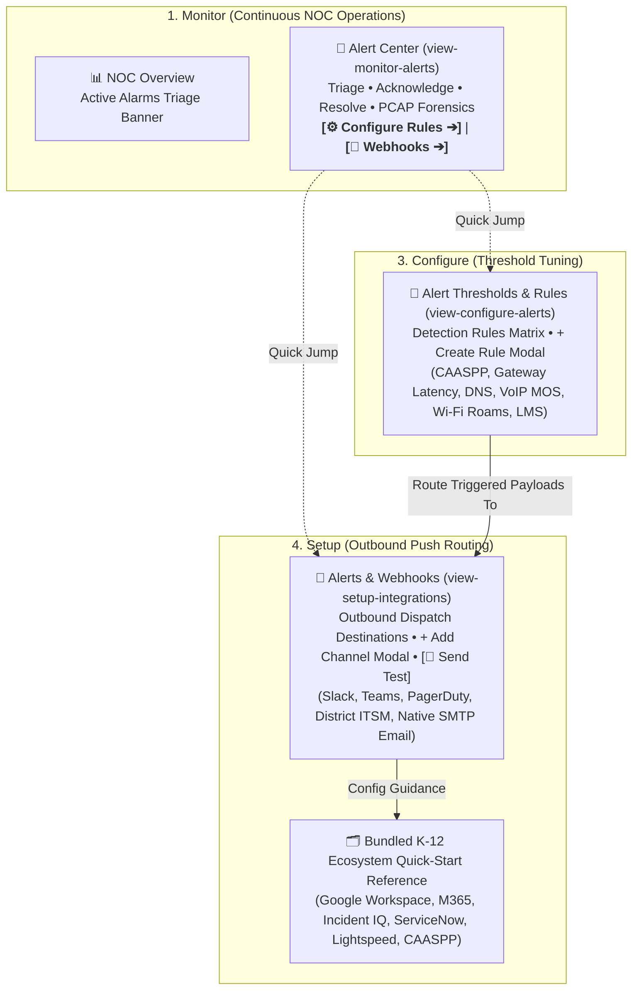

# Project Handoff: Active Alert Center, Custom Detection Rules, & Outbound Notification Dispatcher

**Open Network Experience (ONE) — Central Monitoring Platform (CMP)**
**Date:** August 30, 2026
**License:** GNU AGPLv3

---

## 1. Core Architecture Philosophy & User Directives

### 🌊 The "Waterfall of Attention" Design Model (Verbatim User Decision)
> *"I would like the alerts and threshold settings in 3. and Webhooks in 4 and definitely tie in to the alert center. I think of it as a waterfall of attention: 1. Monitor you will be in all the time, 2. less frequent, 3. infrequent, 4. is during setup or very rarely."*

```
1. Monitor    (Always open)       — NOC Overview, GIS Map, Live Diagnostics, 🚨 Alert Center
2. Manage     (Less frequent)     — Fleet & Registration, Campus Hierarchy, Physical Locations
3. Configure  (Infrequent tuning) — Probe Scheduler, 🚨 Alert Thresholds & Rules, EasyBuilder, OSI Suite
4. Setup      (Setup / rare)      — Server & TSDB, ⚙️ Alerts & Webhooks (Push Integrations)
```

---

## 2. Key Modules & Features Implemented



### A. Active Alert Center (`1. Monitor ➔ Alert Center`)
- **Triage & Incident Lifecycle**: Filtering by Active, Firing, Acknowledged, and Resolved (24h).
- **Forensic PCAP Ring-Buffer Integration**: Automatic freezing of 32MB RAM circular buffers on trigger + on-demand capture button with instant packet dissections.
- **Fast Navigation**: Quick-jump buttons in the header directly to `3. Configure Rules ➔` and `4. Webhooks ➔`.

### B. Custom Alert Detection Rules (`3. Configure ➔ Alert Thresholds`)
- **Detection Rules Matrix**: Lists all active and paused threshold rules.
- **Modal Controls**: Configurable probe selection (CAASPP, DNS, VoIP, Ping, Wi-Fi), metric selection, operators (`>`, `>=`, `<`, `<=`, `=`), duration windows, campus/sensor scope, and auto-PCAP toggle.
- **6 Default Seeded Rules**:
  1. `rule_caaspp_tls`: CAASPP SSL Interception & TLS Failure (`ssl_handshake_status = 0`)
  2. `rule_gateway_latency`: Campus WAN Gateway High Latency (`latency_ms > 35.0 ms`)
  3. `rule_dns_lookup_sla`: Core DNS Multi-Resolver SLA Timeout (`rtt_ms > 500.0 ms`)
  4. `rule_voip_jitter_mos`: Classroom VoIP & Zoom RTP Jitter SLA (`mos_score < 3.8`)
  5. `rule_saas_lms_rtt`: Canvas LMS & Google Classroom Latency Spike (`response_time_ms > 450.0 ms`)
  6. `rule_wifi_flapping`: Wi-Fi AP Channel Hopping & Roam Storm (`roams_per_minute > 6.0`)

### C. Outbound Webhook & Native SMTP Dispatcher (`4. Setup ➔ Alerts & Webhooks`)
- **Non-blocking Asynchronous Dispatcher**: Fire-and-forget background routing for Slack blocks, Teams MessageCards, PagerDuty Events v2, and Generic ITSM / ServiceNow webhooks.
- **Native District Email (SMTP) Engine**:
  - Full `MIMEMultipart("alternative")` engine with plain-text and responsive HTML cards.
  - Supports `STARTTLS` (587), `SSL/TLS` (465), and unauthenticated internal LAN relays (25).
  - Built-in UI presets for **Google Workspace Relay**, **Google App Password**, **Microsoft 365 Exchange Online**, **District LAN Relay**, and **SendGrid**.
- **Live Test Channel Verifier**: `[🔔 Send Test]` button that sends live/mock test payloads and dynamically updates delivery status badges in the UI.

### D. Bundled K-12 Integration Quick-Start Reference
- **Bundle 1: District Email & Identity**: Google Workspace Relay, Microsoft 365 Exchange Online, District On-Premises Postfix/IronPort.
- **Bundle 2: K-12 Helpdesk & ITSM**: Incident IQ, ServiceNow Table API, Freshservice Webhooks, Jira Service Management.
- **Bundle 3: NOC ChatOps & Paging**: Slack, Google Chat Spaces, Microsoft Teams, PagerDuty, Opsgenie.
- **Bundle 4: K-12 Content Safety & Mission-Critical SaaS**: Lightspeed Systems, Securly, GoGuardian, CAASPP/Cambium TDS, Canvas LMS.

---

## 3. Global Rules & User Preferences to Carry Over

1. **Default License Preference**: Default to **GNU AGPLv3** for all new projects, modules, and code.
2. **Project Attribution & Backlinks**: Provide direct official repository/documentation backlinks for external tools (Google Workspace, M365, ServiceNow, Freshservice, Incident IQ, Jira, Slack, Teams, PagerDuty, etc.).
3. **Markdown & Diagram Previews with MDR**:
   - Provide both markdown links and clickable `file://` URLs.
   - Example: `[Open HANDOFF.md](file:///data/Open_Network_Experience/docs/HANDOFF.md) (file:///data/Open_Network_Experience/docs/HANDOFF.md)`
   - Preview command: `mdr <path> &` (or `mdr --backend tui <path>` for headless sessions).

---

## 4. Key Repository Files & Test Baseline

| File Path | Description |
| :--- | :--- |
| [`server/routers/alerts.py`](file:///data/Open_Network_Experience/server/routers/alerts.py) | REST API endpoints for Alertmanager webhooks, custom rules CRUD, channels CRUD, and async SMTP/Webhook dispatcher. |
| [`server/db.py`](file:///data/Open_Network_Experience/server/db.py) | SQLite schemas (`alerts`, `custom_alert_rules`, `notification_channels`), seeded defaults, CRUD operations, and backup/restore. |
| [`server/schemas.py`](file:///data/Open_Network_Experience/server/schemas.py) | Pydantic data contracts for `CustomAlertRuleSpec`, `NotificationChannelSpec`, and `ChannelTestRequest`. |
| [`server/templates/dashboard.html`](file:///data/Open_Network_Experience/server/templates/dashboard.html) | Single-page console with Sidebar navigation, `view-configure-alerts`, `view-setup-integrations`, Rule/Channel modals, and JS controllers. |
| [`server/test_alerts.py`](file:///data/Open_Network_Experience/server/test_alerts.py) | Automated test suite with **13 / 13 passing test cases (100% green)**. |
| [`server/deploy/docker-compose.yml`](file:///data/Open_Network_Experience/server/deploy/docker-compose.yml) | Production Docker Compose stack (`cmp-server`, `victoriametrics`, `alertmanager`, `grafana`, `loki`). |

---

## 5. Potential Next Steps for the New Conversation

1. **Scheduled Maintenance / Muting Windows**: Add scheduled silence periods (e.g., Friday night firewall maintenance) to suppress firing alerts by campus or probe.
2. **Alert Escalation Multi-Tier Policies**: Support multi-step escalation (e.g., Email NOC immediately ➔ Page On-Call via PagerDuty if unacknowledged after 15 minutes).
3. **Grafana Alerting Dashboard Sync**: Provision pre-built Grafana alerting dashboards linked directly to SQLite and VictoriaMetrics.
4. **Edge Sensor Local Rule Evaluation**: Sync custom alert threshold rules down to Raspberry Pi 5 sensors so edge probes can detect SLA breaches locally during WAN backhaul loss.
