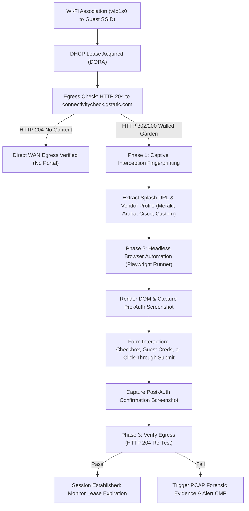

# Strategic Roadmap: Automated Wi-Fi Captive Portal & Walled-Garden Resolution

**Document Version**: 1.0.0  
**Status**: Long-Term Technical Roadmap  
**Target Milestone**: v0.7.0 – v0.8.0  
**License**: GNU AGPLv3  

---

## 1. Executive Summary & Problem Statement

School districts, educational conference centers, higher-ed campuses, and public-facing facilities routinely deploy **Captive Portals (Walled Gardens)** for guest networks, student onboarding (e.g., Aruba ClearPass, Cisco ISE, FortiGuest, Meraki Splash, or custom district splash pages).

When autonomous edge sensors or headless testing appliances connect to these SSIDs:
1. **Network Interception**: All initial HTTP/HTTPS traffic is intercepted via DNS redirection or TCP 80/443 redirection to a splash landing page.
2. **Synthetic Outages**: Synthetic probes (Google Workspace, Canvas LMS, i-Ready, Zoom) fail immediately with TLS handshake mismatch errors or HTTP 302 redirects.
3. **No Human Operator**: Standard sensors have no display or physical keyboard for a human to check "I Accept the Terms" or enter guest credentials.

This roadmap specifies the end-to-end architecture to empower **Open Network Experience (ONE)** edge sensors and Chromebook fleet extensions to autonomously detect, screenshot, solve, authenticate, and monitor captive portal lifecycles without manual IT intervention.

---

## 2. Phased Architecture & Technical Roadmap



---

### Phase 1: Interception Detection & Portal Fingerprinting (v0.7.0)

#### 1.1 Multi-Vendor 204 Probing
The sensor's synthetic daemon will query standard canary endpoints in rapid succession:
- **Google ChromeOS**: `http://connectivitycheck.gstatic.com/generate_204`
- **Apple iOS/macOS**: `http://captive.apple.com/hotspot-detect.html`
- **Microsoft Windows**: `http://www.msftconnecttest.com/connecttest.txt`
- **Ubuntu/Linux**: `http://connectivity-check.ubuntu.com/`

If the response is **not HTTP 204** (or redirects to an internal IP/FQDN), the sensor flags state `PORTAL_INTERCEPTED`.

#### 1.2 Vendor Signature Classifier
By inspecting the redirect destination headers, URL parameters, and initial HTML payload:
| Vendor Signature | Typical Redirection Pattern | Form Type |
| :--- | :--- | :--- |
| **Cisco ISE / DNA-C** | `https://ise.district.org:8443/portal/PortalSetup.action?...` | SAML / Guest Passcode / Clickthrough |
| **Aruba ClearPass** | `https://clearpass.internal/guest/guest_login.php?...` | Self-Registration / Sponsor Email / AUP |
| **FortiGate / FortiGuest** | `http://10.x.x.1:1000/fgtauth?...` | Acceptable Use Policy (AUP) Button |
| **Cisco Meraki** | `https://nXX.meraki.com/splash/...` | Clickthrough / SMS / Meraki Auth |
| **MikroTik RouterOS** | `http://10.x.x.1/login?...` | Simple Form POST (`username`, `password`) |
| **Generic Custom HTML** | Any HTTP 200 containing `<form action="...">` | Fallback DOM Heuristic |

---

### Phase 2: Remote Fleet Policy & Credential Vaulting (v0.7.1)

#### 2.1 CMP Central Management Policy
In the CMP Server, network administrators define Captive Portal interaction policies per SSID profile:

```json
{
  "ssid": "District-Guest",
  "portal_policy": {
    "mode": "auto_authenticate",
    "portal_type": "cisco_ise",
    "strategy": "click_through_aup",
    "form_selectors": {
      "terms_checkbox": "input[type='checkbox'][name*='terms'], input[id*='agree']",
      "submit_button": "button[type='submit'], input[value*='Accept'], #continue_btn"
    },
    "credentials": {
      "username_env": "GUEST_USER",
      "password_env": "GUEST_PASS"
    },
    "max_lease_hours": 8,
    "pre_expire_renewal_minutes": 15
  }
}
```

The CMP distributes this policy to edge sensors via the existing `sensor-reconciler` channel (`/api/v1/sensors/{id}/target_config`).

---

### Phase 3: Autonomous Headless Browser Engine (v0.7.2)

Because modern splash portals heavily rely on client-side JavaScript, single-page frameworks (React/Vue), and canvas fingerprints, simple `curl` or `requests` form-POST scripts frequently fail.

#### 3.1 Containerized Playwright Subsystem
Edge sensors will utilize a dedicated, isolated worker container: `open-network/captive-runner` (based on lightweight Alpine Chromium + Playwright Python):
1. **Launch Isolated Context**: Spins up a headless Chromium context with clean cookies and cache.
2. **Navigate to Splash URL**: Follows redirects with a 15-second timeout.
3. **Execute Strategy**:
   - **Clickthrough Mode**: Detects TOS/AUP checkboxes (`input[type="checkbox"]`), ticks them, and triggers click on `#submit`, `.btn-accept`, or `button:has-text("Connect")`.
   - **Guest Voucher / Passcode Mode**: Fills in designated inputs from encrypted CMP secrets.
4. **Forensic Evidence Archive**:
   - Captures `pre_auth_splash.png` (proving what splash page was presented).
   - Captures `post_auth_result.png` (proving success or failure screen).
   - Saves artifacts to `/var/lib/sensor/evidence/captive/` for automatic ingestion into the CMP Evidence Vault.

---

### Phase 4: Session Lifetime Monitoring & Renewal Daemon (v0.8.0)

Captive portal sessions inherently expire (commonly 2, 4, 8, or 24 hours). When a session expires, client traffic is abruptly severed without link disconnection.

#### 4.1 Continuous Egress Heartbeat
- A 60-second timer fires a background HTTP 204 request.
- When an interception is detected while in `SESSION_ACTIVE`:
  1. Increment Prometheus metric: `wifi_captive_portal_reauth_total{sensor="...", ssid="..."}`.
  2. Record session duration metric: `wifi_captive_portal_session_duration_seconds`.
  3. Re-trigger headless authentication worker.
  4. Emit an informational audit log to VictoriaMetrics & Loki: `"Captive portal lease expired after 28,740 seconds; automated re-authentication completed in 2.34s."`

---

### Phase 5: CMP Wallboard & Incident UI Integration (v0.8.0)

1. **Sensor Status Card**:
   - Badge states: `📶 Direct WAN (No Portal)`, `⚠️ Walled Garden (Intercepted)`, `✅ Portal Authenticated (Lease: 6h 42m remaining)`.
2. **Forensic Inspector**:
   - View captured splash page screenshots directly inside the **Evidence Vault Modal**.
   - Review HTTP redirect chains and response headers.
3. **Emergency Manual Override**:
   - "Authenticate Captive Portal Now" button in the Live Diagnostics panel.
   - Live streaming log output from Playwright runner showing DOM interaction steps.

---

## 3. Milestones & Implementation Tasks

| Milestone | Deliverable | Target Date | Dependencies |
| :--- | :--- | :--- | :--- |
| **M1: Detection Probe** | Integrate `captive_portal` deep detection into `sensor/` with vendor fingerprinting | Sprint 1 | Python `requests`, `urllib` |
| **M2: Fleet Configuration** | Add `portal_policy` fields to CMP sensor schema & reconciler sync | Sprint 2 | CMP SQLite/Postgres schema |
| **M3: Playwright Worker** | Build `open-network/captive-runner` Docker container & test against mock portals | Sprint 3 | Playwright, Chromium |
| **M4: Session Lifecycle** | Implement automated renewal loop and Prometheus telemetry exporter | Sprint 4 | VictoriaMetrics, Node Exporter |
| **M5: UI Evidence Viewer** | Display splash page screenshots in CMP Evidence Modal and Wallboard | Sprint 5 | CMP Frontend (`dashboard.html`, `sensors.js`) |

---

## 4. References & Backlinks

- [Chromium Network Portal Detection Architecture](https://www.chromium.org/chromium-os/how-tos-and-troubleshooting/portal-detection/)
- [Apple Captive Network Assistant (CNA) Specifications](https://developer.apple.com/library/archive/qa/qa1942/_index.html)
- [RFC 7710: Captive-Portal Identification in DHCP / Router Advertisements](https://datatracker.ietf.org/doc/html/rfc7710)
- [RFC 8908: Captive Portal API](https://datatracker.ietf.org/doc/html/rfc8908)
- [Playwright Python Documentation](https://playwright.dev/python/docs/intro)
- [Aruba ClearPass Guest Configuration Guide](https://www.arubanetworks.com/techdocs/ClearPass/6.11/Guest/Default.htm)
