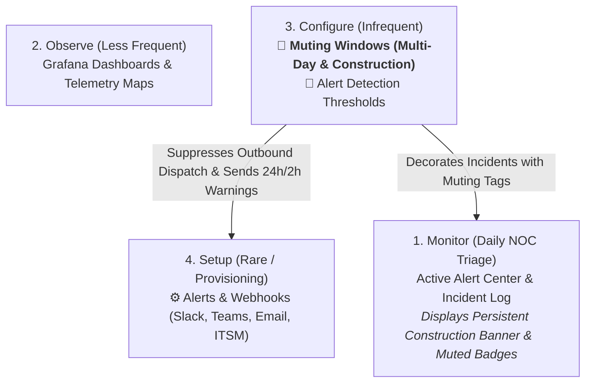

# Scheduled Maintenance & Multi-Day Construction Muting Engine

> **Open Network Experience (ONE)** — Central Monitoring Platform (CMP)
> **License**: [GNU AGPLv3](https://www.gnu.org/licenses/agpl-3.0.html)

---

## 1. Overview & Extended Construction Muting

The **Scheduled Maintenance & Multi-Day Construction Muting Engine** allows school district network administrators, facilities project managers, and NOC engineers to suppress automated outbound alarms during planned maintenance or extended facility construction projects (e.g. 3-day recabling, 1-week/2-week campus rewiring, summer bond projects).

### Core Capabilities
1. **Multi-Day & Custom Durations**:
   - Quick presets for **⚡ 1 Hour**, **🗓️ Weekend (48h)**, **🏗️ 3 Days**, **🏗️ 7 Days (1 Week)**, and **🏗️ 14 Days (2 Weeks)**.
   - Open date/time picker for multi-month summer renovation windows.
2. **Classification & Project Tagging**:
   - Classify windows as `🏗️ Construction / Rewiring`, `🔧 Standard Maintenance`, `⚡ Firmware Upgrade`, or `🏫 Summer Renovation`.
   - Link Facility Bond Project numbers and Change Order tickets (e.g. `Facilities Bond Project #2026-B`, `ServiceNow CHG0034120`).
3. **Continuous Telemetry & Forensic Capture**:
   - Probes and edge sensors continue measuring and recording health telemetry and incident records to SQLite with full rolling PCAP buffers.
   - Matching firing alarms are tagged with `is_muted = True`, `muted_by_window_id`, and `muted_by_window_name`.
4. **Outbound Notification Suppression**:
   - Outbound notifications (Slack, Microsoft Teams, PagerDuty, District ITSM, and SMTP Email) are suppressed for matching probes.
5. **Persistent Alert Center Visual Banner**:
   - The Alert Center displays a dedicated amber **Active Campus Construction Muting** banner showing project name, scope, and scheduled end date.
   - Firing incidents display a purple `🔕 Muted (<Window Name>)` badge.
6. **Automated Expiration Warnings (24h & 2h Dispatches)**:
   - Dispatches automated advance warning alerts to outbound channels 24 hours and 2 hours before a multi-day construction window ends.
   - Alerting automatically resumes upon expiration with zero operator overhead.

---

## 2. Waterfall of Attention Architecture

---

## 3. Data Schema & REST Endpoints

### MaintenanceWindowSpec Schema
| Field | Type | Description |
|---|---|---|
| `id` | `str` | Unique maintenance window identifier |
| `name` | `str` | Descriptive title (e.g. *Science Wing 7-Day Rewiring & Construction*) |
| `description` | `str` | Change control or Bond Project reference |
| `window_type` | `str` | Classification: `construction`, `maintenance`, `upgrade`, `renovation` |
| `campus_id` | `Optional[str]` | Target campus scope filter (`None` for fleet-wide) |
| `sensor_id` | `Optional[str]` | Target sensor scope filter (`None` for all sensors) |
| `probe_id` | `Optional[str]` | Target synthetic probe filter (`None` for all probes) |
| `alertname_pattern` | `Optional[str]` | Glob pattern filter on alert name (e.g. `*Gateway*`, `*WiFi*`) |
| `starts_at` | `int` | Start UTC epoch timestamp |
| `ends_at` | `int` | End UTC epoch timestamp (supports hours, days, or weeks) |
| `is_active` | `bool` | Whether the window is currently enabled |
| `reminded_24h` | `bool` | Whether 24-hour expiration warning was dispatched |
| `reminded_2h` | `bool` | Whether 2-hour expiration warning was dispatched |
| `notify_channel_ids` | `List[str]` | Target notification channels for advance warnings |
| `created_by` | `str` | Operator or Project Manager identity |

### REST Endpoints
- `GET /api/v1/alerts/maintenance-windows`: List all scheduled and active muting windows.
- `POST /api/v1/alerts/maintenance-windows`: Create or update a muting window.
- `GET /api/v1/alerts/maintenance-windows/active-now`: Query all windows currently active right now.
- `POST /api/v1/alerts/maintenance-windows/check-reminders`: Check and dispatch 24h & 2h expiration warning alerts.
- `POST /api/v1/alerts/maintenance-windows/{id}/toggle`: Toggle window active/disabled state.
- `DELETE /api/v1/alerts/maintenance-windows/{id}`: Delete a maintenance window.

---

## 4. Automated Verification

- **Automated Tests**: [`server/test_alerts.py`](file:///data/Open_Network_Experience/server/test_alerts.py)
  - `test_14_maintenance_windows_muting_lifecycle`:
    - 7-day multi-day construction window creation & duration verification.
    - Scope matching on campus, probe, and pattern.
    - 24h & 2h advance expiration warning notification dispatch.
    - Verification that out-of-scope alerts remain unmuted.
- **Test Result**: **14/14 tests passing (100% green)**.
