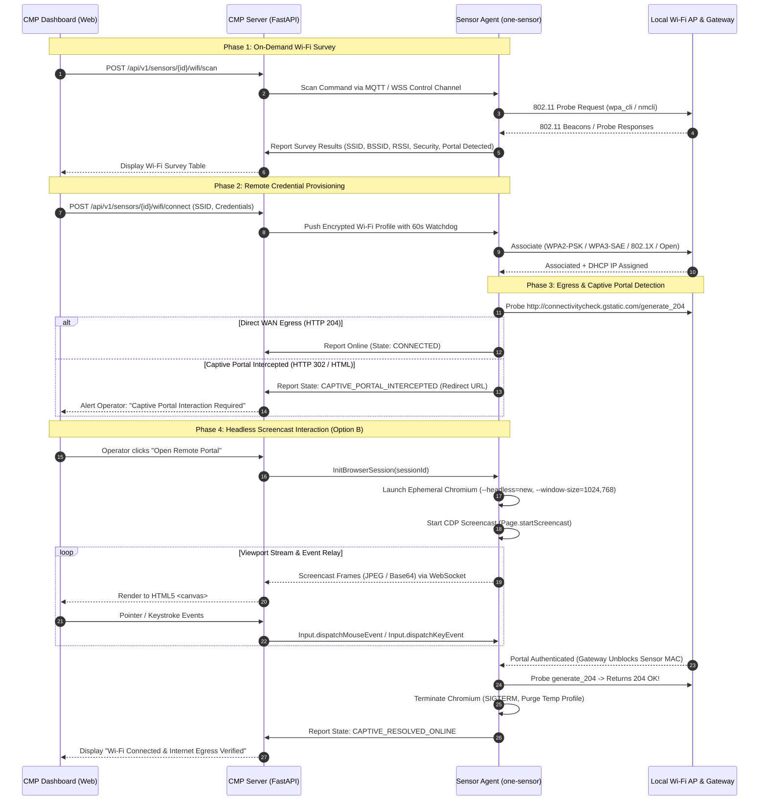

# Technical Specification: Remote Wi-Fi SSID Probing, Provisioning & Captive Portal Traversal (Headless Screencast)

**Document Version**: 1.0.0  
**Status**: Proposal / Ready for Review  
**Target Component**: CMP Server, Sensor Agent, CMP Web Dashboard  
**License**: GNU AGPLv3  

---

## 1. Executive Summary & Problem Statement

School districts, hospitals, and enterprise facilities manage distributed edge sensors across multiple sites. Network operations teams often need to onboard or reconfigure sensors onto local Wi-Fi networks without physical on-site access or serial console access.

Currently:
1. **No Remote SSID Visibility**: The CMP cannot inspect what 2.4 GHz / 5 GHz / 6 GHz SSIDs an edge sensor can hear in its local RF environment.
2. **Manual Wi-Fi Association**: Operators cannot provision Wi-Fi credentials (WPA2/WPA3 PSK, 802.1X EAP, or Open) down to sensors remotely.
3. **Captive Portal Blockers**: When connecting to guest networks (e.g. Cisco ISE, Aruba ClearPass, Meraki Splash, FortiGuest), sensors have no physical display or input peripherals to complete terms-of-service click-throughs, CAPTCHAs, or guest logins. Standard iframes inside the CMP fail due to private subnet routing (`10.0.0.1`), DNS interception, and `X-Frame-Options` restrictions.

This specification defines the end-to-end architecture for:
- **Remote Wi-Fi Survey & Probing**: Triggering on-demand wireless scans from the CMP and returning signal levels (RSSI), frequency, and encryption types.
- **Secure Remote Provisioning**: Pushing encrypted Wi-Fi profiles with automated connection watchdog and fallback rollback.
- **Interactive Captive Portal Traversal (Option B)**: Streaming an ephemeral, headless Chromium viewport from the sensor to the CMP dashboard via Chrome DevTools Protocol (CDP) and WebSocket, enabling operators to interactively complete any captive portal without security header or routing breakage.

---

## 2. End-to-End System Architecture



---

## 3. Component Details & Protocols

### 3.1 Sensor Wi-Fi Survey & Association Subsystem
1. **Wi-Fi Scanner**:
   - Uses `nmcli -t -f SSID,BSSID,CHAN,SIGNAL,SECURITY dev wifi list --rescan yes` or `wpa_cli scan / scan_results`.
   - Normalizes signal strength to dBm and percentages.
   - Detects open networks likely running captive portals.
2. **Safe Association Watchdog**:
   - When switching SSIDs remotely, a bad password or authentication timeout could orphan the sensor from CMP management.
   - **Watchdog Logic**: If the sensor fails to verify uplink to CMP within `T_rollback` (default: 60s), the network stack automatically restores the previous active connection (e.g. Ethernet, cellular, or previous Wi-Fi profile).

### 3.2 Captive Portal Detection Engine
The sensor runs a multi-canary probe:
- Primary: `http://connectivitycheck.gstatic.com/generate_204`
- Secondary: `http://captive.apple.com/hotspot-detect.html`

If the HTTP status code is `302 Found` or returns an HTML body, the target redirect URL is extracted from the `Location` header or meta-refresh tags.

### 3.3 Option B: Headless Chromium Screencast Engine
To bypass CORS, private subnet isolation (`10.0.0.1`), and complex client-side JavaScript / anti-bot mechanisms, the sensor spawns an ephemeral Chromium instance:

#### Command Line Flags for Low-Memory Embedded Devices
```bash
chromium-browser \
  --headless=new \
  --no-sandbox \
  --disable-gpu \
  --disable-dev-shm-usage \
  --disable-software-rasterizer \
  --disable-extensions \
  --disable-background-networking \
  --disable-sync \
  --mute-audio \
  --window-size=1024,768 \
  --remote-debugging-port=9222 \
  --user-data-dir=/tmp/chromium-captive-session \
  "about:blank"
```

#### Chrome DevTools Protocol (CDP) Flow
- **`Page.startScreencast`**:
  ```json
  {
    "method": "Page.startScreencast",
    "params": {
      "format": "jpeg",
      "quality": 75,
      "maxWidth": 1024,
      "maxHeight": 768,
      "everyNthFrame": 1
    }
  }
  ```
- **Pacing with `Page.screencastFrameAck`**: The sensor acknowledges frames to Chromium to maintain smooth streaming without queuing memory spikes.
- **Interactive Input Dispatch**:
  - `Input.dispatchMouseEvent` (`mousePressed`, `mouseReleased`, `mouseMoved`, `mouseWheel`)
  - `Input.dispatchKeyEvent` (`rawKeyDown`, `keyUp`) and `Input.insertText`

#### Edge Resource Envelope
- **RAM Footprint**: ~150–250MB strictly during interactive login.
- **Idle RAM Footprint**: 0MB (Chromium is terminated immediately once HTTP 204 egress is confirmed).
- **Hard Timeout**: 300 seconds maximum runtime watchdog to prevent memory leaks from abandoned sessions.

---

## 4. Token & Session Expiration Management

1. **MAC-Based State (Predominant Model)**:
   In most enterprise WLCs (Aruba, Cisco, UniFi), network authorization is tied to the physical Layer 2 MAC address at the gateway firewall. The sensor itself holds no token.
2. **Session Expiry Detection**:
   The sensor runs a lightweight background daemon checking `http://connectivitycheck.gstatic.com/generate_204` every 60 seconds.
3. **Renewal Workflow**:
   - If the portal returns 302, the sensor marks the session expired.
   - If static terms / guest credentials were saved with policy `auto_reauthenticate: true`, the sensor runs an automated re-submission script.
   - If interactive intervention is required (e.g. 2FA SMS or CAPTCHA), the sensor alerts CMP: `WIFI_CAPTIVE_PORTAL_EXPIRED`.

---

## 5. Security & Isolation Controls

- **Control-Plane Encryption**: All survey data, credentials, and screencast frames flow across existing mutual TLS (mTLS) or authenticated WebSocket channels.
- **Ephemeral Chromium Sandboxing**: User data directory `/tmp/chromium-captive-session` is mounted on tmpfs and securely wiped (`shred`/`rm -rf`) on process exit.
- **Coordinate Boundary Enforcement**: CMP frontend scales click coordinates strictly within the `1024x768` bounding box to avoid input out-of-bounds errors.

---

## 6. Project References & Official Documentation

- **Chrome DevTools Protocol (CDP)**: [CDP Page Domain](https://chromedevtools.github.io/devtools-protocol/tot/Page/) | [CDP Input Domain](https://chromedevtools.github.io/devtools-protocol/tot/Input/)
- **Chromium Project**: [Chromium Headless Mode](https://developer.chrome.com/docs/chromium/new-headless)
- **Browser Screencast Implementations**: [Browserless Screencast Guide](https://www.browserless.io/blog/screencast) | [Playwright Documentation](https://playwright.dev/)
- **IETF Captive Portal Standards**: [RFC 8908 (Captive-Portal Architecture)](https://datatracker.ietf.org/doc/html/rfc8908) | [RFC 8910 (Captive-Portal Identification)](https://datatracker.ietf.org/doc/html/rfc8910)
- **Linux Wireless Utilities**: [NetworkManager DBus API](https://networkmanager.dev/docs/api/latest/) | [wpa_supplicant Documentation](https://w1.fi/wpa_supplicant/)
